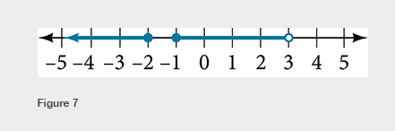

### 3.2 Domain and Range

- The interval notation: See Figure 3

- 🍈 **Caution!!!**: Try It \#5 Figure 7 is wrong! Use the following figure.




- The piecewise function:  a function in which more than one formula is used to define the output.


- 🎯 `jupyter-lab` practice
    - See **sympy.org**: [Piecewise](https://docs.sympy.org/latest/modules/functions/elementary.html?highlight=piecewise#sympy.functions.elementary.piecewise.Piecewise)
    - See **Sympy Tutorial**: 10. SymPy ― Logical Expressions


```
# Absolute value function

from sympy import symbols, Function, Piecewise

x = symbols('x')

f = Function('f')

def f(x):
    formula1 = x
    formula2 = -x
    interval1 = (x >= 0)
    interval2 = (x < 0)
    return Piecewise( (formula1, interval1) , (formula2, interval2) )

f(x)

f(3)

f(-3)

f(0)
```


- 🎯 `jupyter-lab` practice
    - See **sympy.org**: [Piecewise](https://docs.sympy.org/latest/modules/functions/elementary.html?highlight=piecewise#sympy.functions.elementary.piecewise.Piecewise)
    - See **Sympy Tutorial**: 10. SymPy ― Logical Expressions


```
# Example 12

from sympy import symbols, Function, Piecewise

g = symbols('g')

C = Function('C')

def C(g):
    formula1 = 25
    formula2 = 25 + 10*(g - 2)
    interval1 = (g > 0) & (g < 2)
    interval2 = (g >= 2)
    return Piecewise( (formula1, interval1) , (formula2, interval2) )

C(g)

C(1.5)

C(4)
```


- 🎯 `jupyter-lab` practice
    - See **Matplotlib Tutorial**: 6. Matplotlib – Simple Plot


```
# Example 13

%matplotlib widget
import matplotlib.pyplot as plt
import numpy as np

x = np.arange(-4, 4, 0.01)

def f(x):
    conditions = [x <= 1, (x > 1) & (x <= 2), x > 2]
    formulas = [lambda x: x**2, lambda x: 3, lambda x: x]
    result = np.piecewise(x, conditions, formulas)
    return result

plt.style.use('seaborn')
fig, ax = plt.subplots()
ax.plot(x, f(x))
plt.xlim(-4,4)
plt.ylim(-1,5)
```