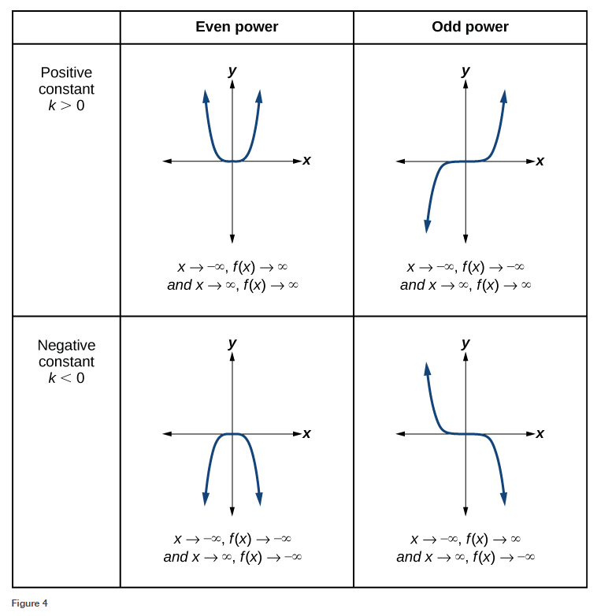

### 5.2 Power Functions and Polynomial Functions

- The power function
$$ y = f(x) = k x^{p} $$
where $k, p \in \mathbb{R}$ and $k$ is known as the coeffiicient. 


- 🎯 `jupyter-lab` practice
    - See **Matplotlib Tutorial**: 6. Matplotlib – Simple Plot


```
# Figure 2

%matplotlib widget
import matplotlib.pyplot as plt
import numpy as np

x = np.arange(-3, 3, 0.01)
y1 = x**2
y2 = x**4
y3 = x**6

plt.style.use('seaborn')
fig, ax = plt.subplots()
ax.plot(x, y1, 'g', x, y2, 'c', x, y3, 'r')
ax.legend(labels=('$y = x^2$', '$y = x^4$', '$y = x^6$'), loc='lower left')
plt.xlim(-3, 3)
plt.ylim(-1, 5)
```


- The even-power function $y = f(x) = kx^p$ end behavior
$$ x \rightarrow \pm\infty, \; f(x) \rightarrow \infty $$
where $k > 0$, $p$ is an even number.

- The even-power function $y = f(x) = kx^p$ end behavior
$$ x \rightarrow \pm\infty, \; f(x) \rightarrow -\infty $$
where $k < 0$, $p$ is an even number.


- 🎯 `jupyter-lab` practice
    - See **Matplotlib Tutorial**: 6. Matplotlib – Simple Plot


```
# Figure 3

%matplotlib widget
import matplotlib.pyplot as plt
import numpy as np

x = np.arange(-2, 2, 0.01)
y1 = x**3
y2 = x**5
y3 = x**7

plt.style.use('seaborn')
fig, ax = plt.subplots()
ax.plot(x, y1, 'g', x, y2, 'c', x, y3, 'r')
ax.legend(labels=('$y = x^3$', '$y = x^5$', '$y = x^7$'), loc='lower right')
plt.xlim(-2, 2)
plt.ylim(-4, 4)
```


- The odd-power function $y = f(x) = kx^p$ end behavior
$$ x \rightarrow -\infty, \; f(x) \rightarrow -\infty \\ x \rightarrow \infty, \; f(x) \rightarrow \infty  $$
where $k > 0$, $p$ is an odd number.

- The odd-power function $y = f(x) = kx^p$ end behavior
$$ x \rightarrow -\infty, \; f(x) \rightarrow \infty \\ x \rightarrow \infty, \; f(x) \rightarrow -\infty  $$
where $k < 0$, $p$ is an odd number.

- Caution! Figure 4 is wrong in the printed book.
The correct figure is given in the online version as below.
