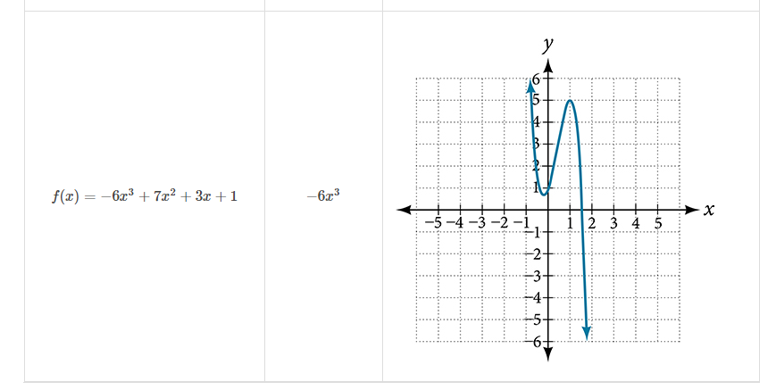

### 5.2 Power Functions and Polynomial Functions

- The power function
$$ y = f(x) = k x^{p} $$
where $k, p \in \mathbb{R}$ and $k$ is known as the coeffiicient. 


- 🎯 `jupyter-lab` practice
    - See **Matplotlib Tutorial**: 6. Matplotlib – Simple Plot


```
# Figure 2

%matplotlib widget
import matplotlib.pyplot as plt
import numpy as np

x = np.arange(-3, 3, 0.01)
y1 = x**2
y2 = x**4
y3 = x**6

plt.style.use('seaborn')
fig, ax = plt.subplots()
ax.plot(x, y1, 'g', x, y2, 'c', x, y3, 'r')
ax.legend(labels=('$y = x^2$', '$y = x^4$', '$y = x^6$'), loc='lower left')
plt.xlim(-3, 3)
plt.ylim(-1, 5)
```


- The even-power function $y = f(x) = kx^p$ end behavior
$$ x \rightarrow -\infty, \; f(x) \rightarrow \infty \\ x \rightarrow \infty, \; f(x) \rightarrow \infty  $$
where $k > 0$, $p$ is an even number.

- The even-power function $y = f(x) = kx^p$ end behavior
$$ x \rightarrow -\infty, \; f(x) \rightarrow -\infty \\ x \rightarrow \infty, \; f(x) \rightarrow -\infty  $$
where $k < 0$, $p$ is an even number.


- 🎯 `jupyter-lab` practice
    - See **Matplotlib Tutorial**: 6. Matplotlib – Simple Plot


```
# Figure 3

%matplotlib widget
import matplotlib.pyplot as plt
import numpy as np

x = np.arange(-2, 2, 0.01)
y1 = x**3
y2 = x**5
y3 = x**7

plt.style.use('seaborn')
fig, ax = plt.subplots()
ax.plot(x, y1, 'g', x, y2, 'c', x, y3, 'r')
ax.legend(labels=('$y = x^3$', '$y = x^5$', '$y = x^7$'), loc='lower right')
plt.xlim(-2, 2)
plt.ylim(-4, 4)
```


- The odd-power function $y = f(x) = kx^p$ end behavior
$$ x \rightarrow -\infty, \; f(x) \rightarrow -\infty \\ x \rightarrow \infty, \; f(x) \rightarrow \infty  $$
where $k > 0$, $p$ is an odd number.

- The odd-power function $y = f(x) = kx^p$ end behavior
$$ x \rightarrow -\infty, \; f(x) \rightarrow \infty \\ x \rightarrow \infty, \; f(x) \rightarrow -\infty  $$
where $k < 0$, $p$ is an odd number.

- Caution! Figure 4 is wrong in the printed book.
The correct figure is given in the online version as below.


- The general form of polynomial function
$$ y = f(x) = a_n x^n + \dots + a_2 x^2 + a_1 x + a_0 $$
where $n$ is non-negative integer, $a_0, a_1, \dots, a_n \in \mathbb{R}$. 
    - Each expression $a_i x^i$ is a term of polynomial function.
    - $n$ is the degree of the polynomial function
    - $a_n x^n$ is the leading term of the polynomial function
    - $a_n$ is the leading coefficient of the polynomial function

- Caution! Table 3 (c, d) is wrong in the printed book.
The correct figure is given in the online version as below.




- 🎯 `jupyter-lab` practice
    - See **Matplotlib Tutorial**: 6. Matplotlib – Simple Plot


```
# Table 3 a

%matplotlib widget
import matplotlib.pyplot as plt
import numpy as np

x = np.arange(-6, 6, 0.01)
y = 5*x**4 + 2*x**3 - x - 4

plt.style.use('seaborn')
fig, ax = plt.subplots()
ax.plot(x, y)
plt.xlim(-6, 6)
plt.ylim(-6, 6)
plt.title("$f(x) = 5x^4 + 2x^3 - x - 4$")
```

```
# Table 3 b

%matplotlib widget
import matplotlib.pyplot as plt
import numpy as np

x = np.arange(-6, 6, 0.01)
y = -2*x**6 - x**5 + 3*x**4 + x**3

plt.style.use('seaborn')
fig, ax = plt.subplots()
ax.plot(x, y)
plt.xlim(-6, 6)
plt.ylim(-6, 6)
plt.title("$f(x) = -2x^6 - x^5 + 3x^4 + x^3$")
```

```
# Table 3 c

%matplotlib widget
import matplotlib.pyplot as plt
import numpy as np

x = np.arange(-6, 6, 0.01)
y = 3*x**5 - 4*x**4 + 2*x**2 + 1

plt.style.use('seaborn')
fig, ax = plt.subplots()
ax.plot(x, y)
plt.xlim(-6, 6)
plt.ylim(-6, 6)
plt.title("$f(x) = -2x^6 - x^5 + 3x^4 + x^3$")
```

```
# Table 3 d

%matplotlib widget
import matplotlib.pyplot as plt
import numpy as np

x = np.arange(-6, 6, 0.01)
y = -6*x**3 + 7*x**2 + 3*x + 1

plt.style.use('seaborn')
fig, ax = plt.subplots()
ax.plot(x, y)
plt.xlim(-6, 6)
plt.ylim(-6, 6)
plt.title("$f(x) = -6x^3 + 7x^2 + 3x + 1$")
```

