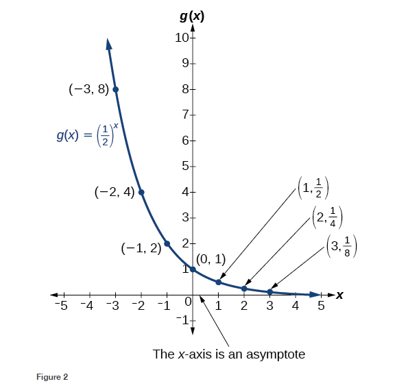
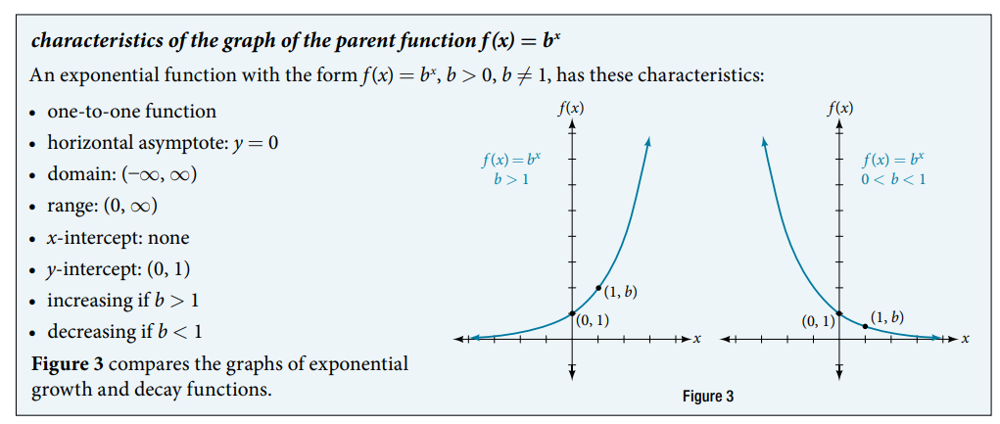

### 6.2 Graphs of Exponential Functions

- 🎯 `jupyter-lab` practice


```
# Figure 1

%matplotlib widget
import matplotlib.pyplot as plt
import numpy as np

x = np.arange(-6, 6, 0.01)
y = 2**x

x_sample = [-3, -2, -1, 0, 1, 2, 3]
y_sample = [1/8, 1/4, 1/2, 1, 2, 4, 8]

fig, ax = plt.subplots()
ax.plot(x, y)
ax.scatter(x_sample, y_sample, color='k')
ax.grid()
ax.set_aspect('equal', 'box')
plt.xlim(-6, 6)
plt.ylim(-2, 10)
```

- Figure 2 (the online version): 


- 🎯 `jupyter-lab` practice


```
# Figure 2

%matplotlib widget
import matplotlib.pyplot as plt
import numpy as np

x = np.arange(-6, 6, 0.01)
y = (1/2)**x

x_sample = [-3, -2, -1, 0, 1, 2, 3]
y_sample = [8, 4, 2, 1, 1/2, 1/4, 1/8]

fig, ax = plt.subplots()
ax.plot(x, y)
ax.scatter(x_sample, y_sample, color='k')
ax.grid()
ax.set_aspect('equal', 'box')
plt.xlim(-6, 6)
plt.ylim(-2, 10)
```

- See Figure 3: 

- 🎯 `jupyter-lab` practice


```
# Example 1

%matplotlib widget
import matplotlib.pyplot as plt
import numpy as np

x = np.arange(-6, 6, 0.01)
y = (0.25)**x

x_sample = [-1, 0, 1]
y_sample = [4, 1, 0.25]

fig, ax = plt.subplots()
ax.plot(x, y)
ax.scatter(x_sample, y_sample, color='k')
ax.axhline(y = 0, color='r', linestyle='--')
ax.grid()
ax.set_aspect('equal', 'box')
plt.xlim(-6, 6)
plt.ylim(-6, 6)
```


- 🎯 `jupyter-lab` practice


```
# Example 2

%matplotlib widget
import matplotlib.pyplot as plt
import numpy as np

x = np.arange(-6, 6, 0.01)
y = 2**(x + 1) - 3

x_sample = [-1, 0, 1]
y_sample = [-2, -1, 1]

fig, ax = plt.subplots()
ax.plot(x, y)
ax.scatter(x_sample, y_sample, color='k')
ax.axhline(y = -3, color='r', linestyle='--')
ax.grid()
#ax.set_aspect('equal', 'box')
plt.xlim(-6, 6)
plt.ylim(-12, 12)
```

- 🎯 `jupyter-lab` practice


```
# Example 3

from sympy import symbols, Eq, solveset, S

x = symbols('x')

expr = Eq(42, 1.2*5**x + 2.8)
expr

x_approx = solveset(expr, x, domain=S.Reals).evalf()
x_approx = list(x_approx)[0]
x_approx
```


- See Table 6