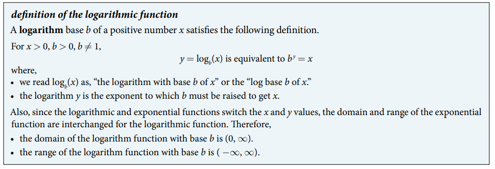

### 6.3 Logarithmic Functions

- Summary 


- 🎯 `jupyter-lab` practice


```
# Example 1

from sympy import symbols, log, sqrt, simplify

log(sqrt(6), 6)

simplify(log(sqrt(6), 6))

log(9, 3)
```

- The common logarithm: the logarithm if $b = 10$
$$ y = \log_{10}(x) = \log(x) $$


- 🎯 `jupyter-lab` practice


```
# Example 6

from sympy import symbols, log

log(321, 10).evalf()
```


- The natural logarithm: the logarithm if $b = e$
$$ y = \log_{e}(x) = \ln(x) $$


- 🎯 `jupyter-lab` practice


```
# Example 8

from sympy import symbols, log, E

log(500, E).evalf()
```
