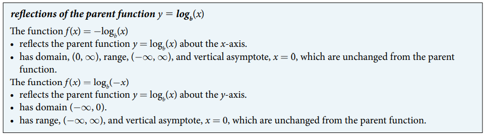
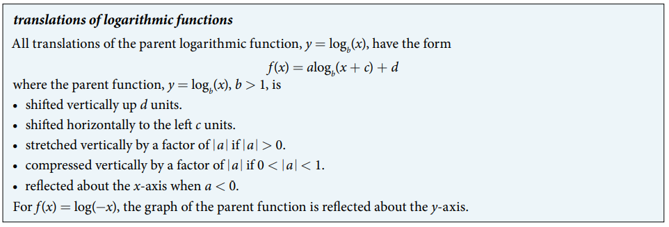

### 6.4 Graphs of Logarithmic Functions

- 🎯 `jupyter-lab` practice
    - `numpy`'s `log()` means the natural logarithm $\log_{e}() = \ln()$.
    - `numpy`'s `log10()` means the common logarithm $\log_{10}() = \log()$.
    - `numpy`'s `log2()` means the logarithm $\log_{2}()$.

```
# Figure 2

%matplotlib widget
import matplotlib.pyplot as plt
import numpy as np

x1 = np.arange(-6, 6, 0.01)
f = 2**x1

x2 = np.arange(0.01, 6, 0.01)
g = np.log2(x2)

fig, ax = plt.subplots()
ax.plot(x1, f, 'r')
ax.plot(x2, g)
ax.axline((0, 0), (1, 1), color='g', linestyle='--')
ax.scatter(0, 1, s=20, color='r')
ax.scatter(1, 0, s=20)
ax.set_aspect('equal', 'box')
plt.grid(which='major', color='#666666', linestyle='-')
plt.minorticks_on()
plt.grid(which='minor', color='#999999', linestyle='-', alpha=0.2)
plt.xlim(-6, 6)
plt.ylim(-6, 6)
```

- Summary 

- Figure 6 

- Summary 


- 🎯 `jupyter-lab` practice
    - `numpy` dose not provide `log3()`, `log4()`, `log5()`, ... because such logs can be built using `log()`.
    - For exmaple, `log3()` is equivalent to `log()/log(3)`. 

```
# Example 4

%matplotlib widget
import matplotlib.pyplot as plt
import numpy as np

x1 = np.arange(0.01, 10, 0.01)
parent = np.log(x1)/np.log(3) # equivalent to log3(x1)

x2 = np.arange(2.01, 10, 0.01)
f = np.log(x2 - 2)/np.log(3)

fig, ax = plt.subplots()

ax.plot(x1, parent)
ax.plot(x2, f, 'r')
ax.axvline(x = 0, color='g', linestyle='--')
ax.axvline(x = 2, color='g', linestyle='--')

ax.scatter(1/3, -1, s=20, color='k')
ax.scatter(1, 0, s=20, color='k')
ax.scatter(3, 1, s=20, color='k')

ax.scatter(1/3 + 2, -1, s=20, color='k')
ax.scatter(1 + 2, 0, s=20, color='k')
ax.scatter(3 + 2, 1, s=20, color='k')

ax.set_aspect('equal', 'box')
plt.grid(which='major', color='#666666', linestyle='-')
plt.minorticks_on()
plt.grid(which='minor', color='#999999', linestyle='-', alpha=0.2)
plt.xlim(-2, 10)
plt.ylim(-6, 6)
```


- Figure 8 

- Summary 


- 🎯 `jupyter-lab` practice

```
# Example 5

%matplotlib widget
import matplotlib.pyplot as plt
import numpy as np

x = np.arange(0.01, 10, 0.01)
parent = np.log(x)/np.log(3) # equivalent to log3(x)
f = np.log(x)/np.log(3) - 2

fig, ax = plt.subplots()

ax.plot(x, parent)
ax.plot(x, f, 'r')
ax.axvline(x = 0, color='g', linestyle='--')

ax.scatter(1/3, -1, s=20, color='k')
ax.scatter(1, 0, s=20, color='k')
ax.scatter(3, 1, s=20, color='k')

ax.scatter(1/3, -1 - 2, s=20, color='k')
ax.scatter(1, 0 - 2, s=20, color='k')
ax.scatter(3, 1 - 2, s=20, color='k')

ax.set_aspect('equal', 'box')
plt.grid(which='major', color='#666666', linestyle='-')
plt.minorticks_on()
plt.grid(which='minor', color='#999999', linestyle='-', alpha=0.2)
plt.xlim(-2, 10)
plt.ylim(-6, 6)
```


- Figure 10 

- Summary 


- 🎯 `jupyter-lab` practice

```
# Example 6

%matplotlib widget
import matplotlib.pyplot as plt
import numpy as np

x = np.arange(0.01, 10, 0.01)
parent = np.log(x)/np.log(4) # equivalent to log4(x)
f = 2*(np.log(x)/np.log(4))

fig, ax = plt.subplots()

ax.plot(x, parent)
ax.plot(x, f, 'r')
ax.axvline(x = 0, color='g', linestyle='--')

ax.scatter(1/4, -1, s=20, color='k')
ax.scatter(1, 0, s=20, color='k')
ax.scatter(4, 1, s=20, color='k')

ax.scatter(1/4, -1*2, s=20, color='k')
ax.scatter(1, 0*2, s=20, color='k')
ax.scatter(4, 1*2, s=20, color='k')

ax.set_aspect('equal', 'box')
plt.grid(which='major', color='#666666', linestyle='-')
plt.minorticks_on()
plt.grid(which='minor', color='#999999', linestyle='-', alpha=0.2)
plt.xlim(-2, 10)
plt.ylim(-6, 6)
```


- 🎯 `jupyter-lab` practice

```
# Example 7

%matplotlib widget
import matplotlib.pyplot as plt
import numpy as np

x = np.arange(-2 + 0.01, 6, 0.01)
y1 = 5*np.log10(x + 2)
y2 = np.log10(x + 2)

xx = np.arange(0.01, 6, 0.01)
y3 = np.log10(xx)

fig, ax = plt.subplots()

ax.plot(x, y1)
ax.plot(x, y2, 'orange')
ax.plot(xx, y3, 'r')

ax.axvline(x = 0, color='g', linestyle='--')
ax.axvline(x = -2, color='g', linestyle='--')

ax.set_aspect('equal', 'box')
plt.grid(which='major', color='#666666', linestyle='-')
plt.minorticks_on()
plt.grid(which='minor', color='#999999', linestyle='-', alpha=0.2)
plt.xlim(-6, 6)
plt.ylim(-6, 6)
```


- Figure 13 

- Summary 


- 🎯 `jupyter-lab` practice

```
# Example 8

%matplotlib widget
import matplotlib.pyplot as plt
import numpy as np

x1 = np.arange(0.01, 6, 0.01)
parent = np.log10(x1)

x2 = np.arange(-6, -0.01, 0.01)
f = np.log10(-x2)

fig, ax = plt.subplots()

ax.plot(x1, parent)
ax.plot(x2, f, 'r')

ax.axvline(x = 0, color='g', linestyle='--')

ax.set_aspect('equal', 'box')
plt.grid(which='major', color='#666666', linestyle='-')
plt.minorticks_on()
plt.grid(which='minor', color='#999999', linestyle='-', alpha=0.2)
plt.xlim(-6, 6)
plt.ylim(-6, 6)
```


- 🎯 `jupyter-lab` practice

```
# Example 9

%matplotlib widget
import matplotlib.pyplot as plt
import numpy as np

x1 = np.arange(0.01, 7, 0.001)
f1 = 4*(np.log(x1)) + 1

x2 = np.arange(1 + 0.01, 7, 0.001)
f2 = (-2)*(np.log(x2 - 1))

fig, ax = plt.subplots()

ax.plot(x1, f1)
ax.plot(x2, f2, 'r')

ax.axvline(x = 0, color='g', linestyle='--')
ax.axvline(x = 1, color='g', linestyle='--')

ax.scatter(1.338529955, 2.166287569, s=20, color='k') # graphical solution

#ax.set_aspect('equal', 'box')
plt.grid(which='major', color='#666666', linestyle='-')
plt.minorticks_on()
plt.grid(which='minor', color='#999999', linestyle='-', alpha=0.2)
plt.xlim(-1, 7)
plt.ylim(-7, 7)
```


- Table 4 

- Summary 
