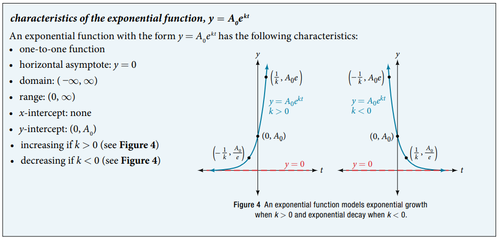

### 6.7 Exponential and Logarithmic Models

- The exponential growth function
$$ y = A(t) = A_0 e^{kt} $$
    - $k > 0$: the rate of growth
    - $k < 0$: the rate of decay
    - doubling time: $t = \dfrac{\ln{(2)}}{k} $
    - half-life: $t = -\dfrac{\ln{(2)}}{k} = \dfrac{\ln{(0.5)}}{k} $

- Order of magnitude: For example,
$$40,113,497,200,000 = 4.01134972 \times 10^{13}$$
where this big number is order of magnitude $10^{13}$.

- Summary 

- 🎯 `jupyter-lab` practice

```
# Example 1

from sympy import symbols, Function, exp, log, Eq, solveset, S, plot

t, A0, k = symbols('t, A0, k')

A = Function('A')

def A(t):
    return A0*exp(k*t)
    
A0 = 10

expr = Eq(2*A0, A(1))
expr

sol = solveset(expr, k, S.Reals)
sol

k = list(sol)[0]

k

k.evalf()

plot(t, A(t)) # See https://docs.sympy.org/latest/modules/plotting.html
```

- 🎯 `jupyter-lab` practice

```
# Example 2, Example 3

from sympy import symbols, Function, exp, log, Eq, solveset, S

t, A0, k = symbols('t, A0, k')

A = Function('A')

def A(t):
    return A0*exp(k*t)

expr = Eq(0.5*A0, A0*exp(k*5730))
expr

sol = solveset(expr, k, S.Reals)
sol

log(0.5)/5730

k = list(sol)[0]
k

def A(t):
    return A0*exp(k*t)

A(0)

A(5730)

solveset(Eq(0.2*A0, A(t)), t, S.Reals) # Example 3
```

- Newton's law of cooling
$$ T(t) = A e^{kt} + T_s = (T_0 - T_s) e^{kt} $$
    - $t$ is time
    - $T(t)$ is temperature at $t$
    - $T_0$ is the initial temperature $T_0 = T(0)$
    - $T_s$ is the temperature of surrounding air
    - $A = T_0 - T_s$
    - $k$ is a constant, the continuous rate of cooling of the object


- 🎯 `jupyter-lab` practice

```
# Example 5

from sympy import symbols, Function, exp, log, Eq, solveset, S

t, T0, Ts, A, k = symbols('t, T0, Ts, A, k')

T = Function('T')

T0 = 165

Ts = 35

A = T0 - Ts

def T(t):
    return A*exp(k*t) + Ts
    
T(t) # k, t are unspecified

expr = Eq(150, T(10))
expr

sol = solveset(expr, k, S.Reals)
k = list(sol)[0]
k

T(t) # k is specified

expr = Eq(70, T(t))
expr

t_eat = solveset(expr, t, S.Reals)
t_eat = list(t_eat)[0]

t_eat.evalf()
```

- The logistic model
$$ f(x) = \dfrac{c}{1 + ae^{-bx}} $$
    - $a, b, c,  > 0$ 
    - $c$ is the carrying capacity, or limiting value
    - $b$ is a constant determined by the rate of growth
    - $f(0) = \dfrac{c}{1 + a}$ is the initial value

- 🎯 `jupyter-lab` practice

```
# Figure 6

from sympy import symbols, Function, exp, log, Eq, solveset, S

from sympy import symbols, Function, exp, log, plot

a, b, c, x = symbols('a, b, c, x')

f = Function('f')

def f(x):
    return c/(1 + a*exp(-b*x))

f(x)

f(0)

f(log(a)/b)

a = 1

b = 1

c = 1

p = plot(f(x), show=False)
p.extend(plot(c, line_color='r', show=False))
p.show()
```


- 🎯 `jupyter-lab` practice

```
# Example 6

from sympy import symbols, Function, exp, log, Eq, solveset, S

from sympy import symbols, Function, exp, log, plot

a, b, c, x = symbols('a, b, c, x')

f = Function('f')

def f(x):
    return c/(1 + a*exp(-b*x))

f(x)

f(0)

f(log(a)/b)

a = 999
b = 0.6030
c = 1000

f(10)

int(f(10) + 0.5) # rounding to the nearest integer
```


- 🎯 `jupyter-lab` practice

```
# Figure 7

%matplotlib widget
import matplotlib.pyplot as plt
import numpy as np

x = np.arange(0, 26, 0.01)
y = 1000/(1 + 999*np.exp(-0.6030*x))

fig, ax = plt.subplots()
ax.plot(x, y)
ax.axhline(y = 1000, color='r', linestyle='--')

def f(xx):
    return 1000/(1 + 999*np.exp(-0.6030*xx))

ax.scatter(0, f(0), s=20, color='k')
ax.scatter(5, f(5), s=20, color='k')
ax.scatter(10, f(10), s=20, color='k')
ax.scatter(21, f(21), s=20, color='k')

plt.grid(which='major', color='#666666', linestyle='-')
plt.minorticks_on()
plt.grid(which='minor', color='#999999', linestyle='-', alpha=0.2)

plt.xlim(-1, 26)
plt.ylim(-100, 1100)
```