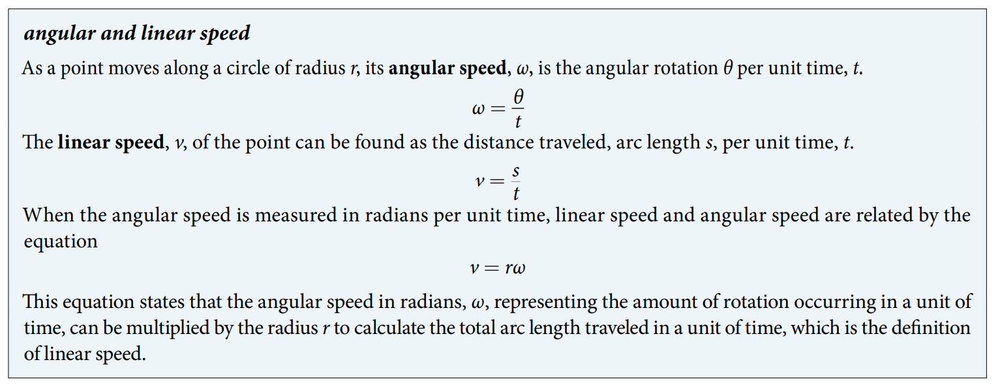

### 7.1 Angles

- A ray consists of one point on a line and all points extending in one direction from that point. (See Figure 1)

- An angle is the union of two rays having a common endpoint. (See Figure 2) The endpoint is called the vertex of the angle, and the two rays are the sides of the angle

- the measure of an angle is a real number

- The fixed ray is the initial side, and the rotated ray is the terminal side. (See Figure 4)

- The measure of an angle is the amount of rotation from the initial side to the terminal side.

- One degree $1^{\circ}$ is $\dfrac{1}{360}$ of a circular rotation.

- An angle is in standard position if its vertex is located at the origin, and its initial side extends along the positive $x$-axis (See Figure 5).

- If the angle is measured in a counterclockwise (ccw) direction from the initial side to the terminal side, the angle is said to be a positive angle.

- If the angle is measured in a clockwise (cw) direction, the angle is said to be a negative angle.

- An angle is a quadrantal angle if its terminal side lies on an axis, including $0^\circ$, $90^\circ$, $180^\circ$, $270^\circ$, or $360^\circ$.

- Youtube
    - [Circumference of a circle, $2 \pi r$, How to get the Formula](https://www.youtube.com/watch?v=riNAA-jx0u8)

- One radian is the measure of a central angle of a circle that intercepts an arc equal in length to the radius of that circle. (See Figure 11)

- In fact, radian measure is dimensionless, since it is the quotient of a length (circumference) divided by a length (radius) and the length units cancel out.

- An arc length is the length of the curve along the arc. (See Figure 12)

- Summary
$$ 1 \text{ rotation } = 360^\circ = 2\pi \text{ radians} \\
 \dfrac{1}{2} \text{ rotation } = 180^\circ = \pi \text{ radians} \\
 \dfrac{1}{4} \text{ rotation } = 90^\circ = \dfrac{\pi}{2} \text{ radians} \\
 \dfrac{1}{360} \text{ rotation } = 1^\circ = \dfrac{\pi}{180} \text{ radians} \\
 \dfrac{1}{2\pi} \text{ rotation } = \dfrac{180}{\pi}^\circ = 1 \text{ radians} 
$$

- converting between radians and degrees
$$ \dfrac{\theta}{180} = \dfrac{\theta_{R}}{\pi} $$
where $\theta$ is measured in degree and $\theta_{R}$ is measured in radian.

- Coterminal angles are two angles in standard position that have the same terminal side. (See Figure 16)

- An angle’s reference angle is the size of the smallest acute angle, $t^\prime$  ($0^{\circ} < t^\prime < 90^{\circ}$), formed by the terminal side of the angle $t$ and the horizontal axis.

- In a circle of radius $r$, the length of an arc $s$ subtended by an angle with measure $\theta$ in radians
$$ s = r\theta $$
(See Figure 21)

- Youtube
    - [Area of Circle — Formula Derivation (Proof), Example](https://www.youtube.com/watch?v=1BAl7yqIDMk)
    
- The area of a sector of a circle with radius $r$ subtended by an angle $\theta$, measured in radians, arc length $s$, is
$$ A = \left( \dfrac{\theta}{2\pi} \pi r^2 \right) = \frac{1}{2} \theta r^2 = \frac{1}{2} rs $$ 
(See Figure 22)

