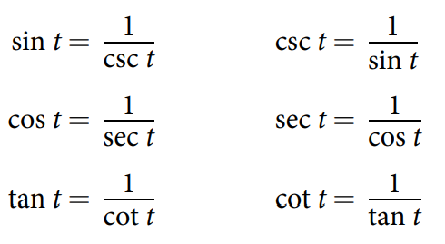

### 7.2 Right Triangle Trigonometry

- The unit circle (See Figure 1)


- The adjacent side, the opposite side, the hypotenuse (See Figure 2)


- Sine, cosine, tangent


- Secant, cosecant, cotangent



- Side lengths of special triangles


- Two complementary angles: their sum results in $\dfrac{\pi}{2}$

- An cofunction identity:


- 🎯 `jupyter-lab` practice

```
# Example 5

from sympy import symbols, pi, sin, tan, Eq, solveset

alpha = symbols('alpha')
alpha

a, c = symbols('a, c')

alpha = 30 # degree
alpha

alpha = alpha*(pi/180) # convert degree to radian
alpha

expr_a = Eq(tan(alpha), 7/a)
expr_a

sol_a = solveset(expr_a, a)
sol_a

sol_a.evalf()

expr_c = Eq(sin(alpha), 7/c)
expr_c

sol_c = solveset(expr_c, c)
sol_c

sol_c.evalf()
```

- The angle of elevation, the angle of depression (See Figure 12)
