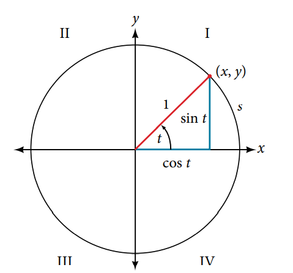
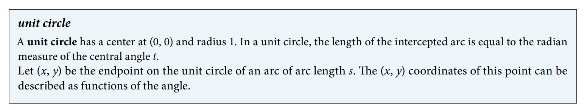
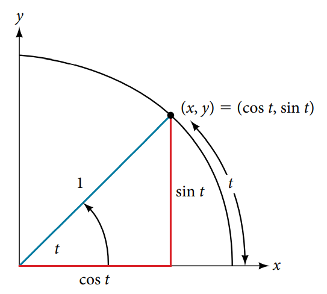
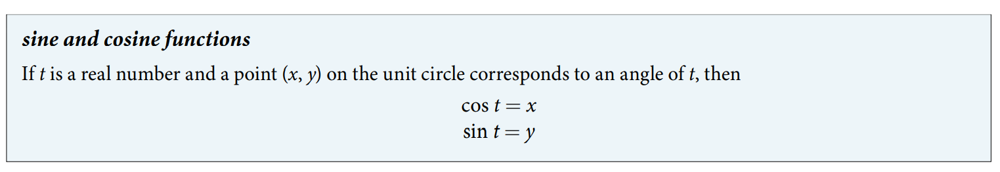
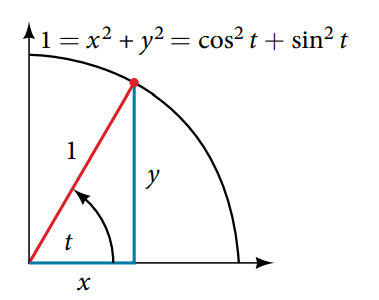
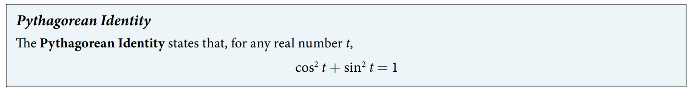
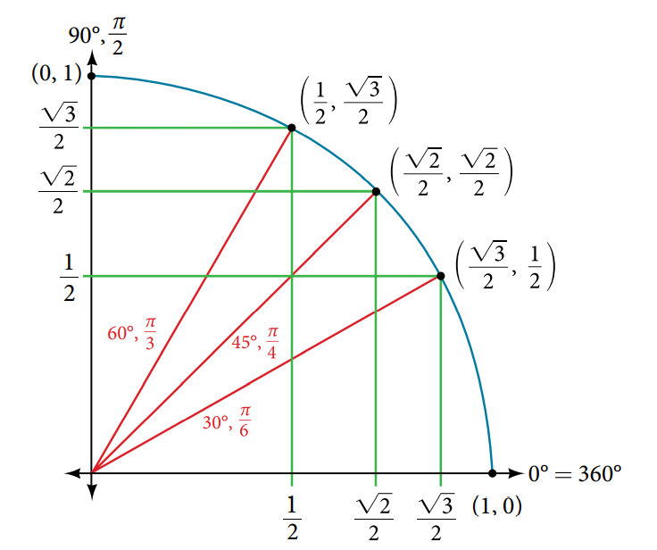
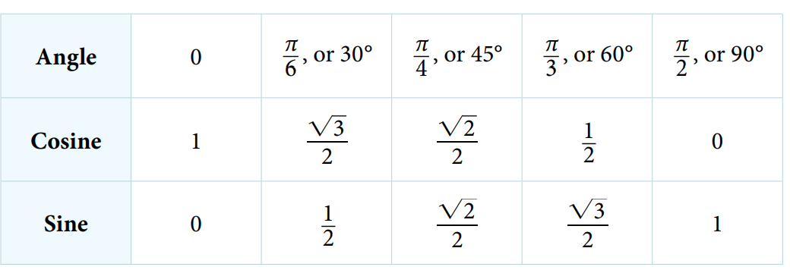
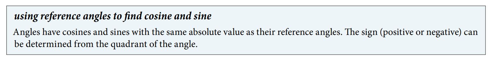
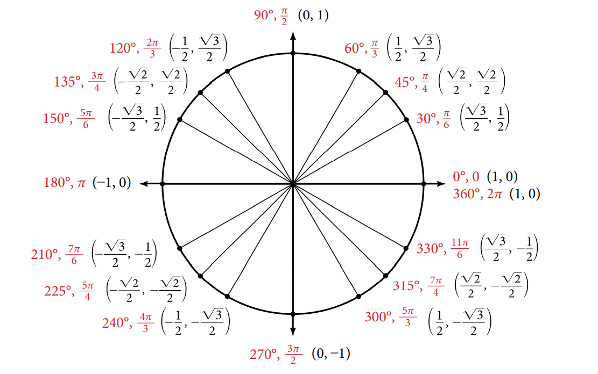

### 7.3 Unit Circle

- The unit circle (See Figure 2)

- The sine function and the cosine function (See Figure 3)

- The Pythagorean Identity (See Figure 7)

- The sine function and the cosine function at special angles

- Using reference angle to find sine and cosine (See Figure 17)

