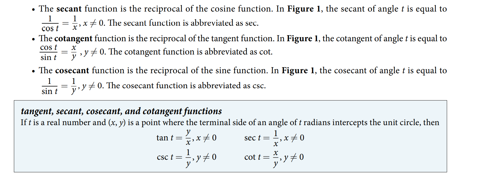
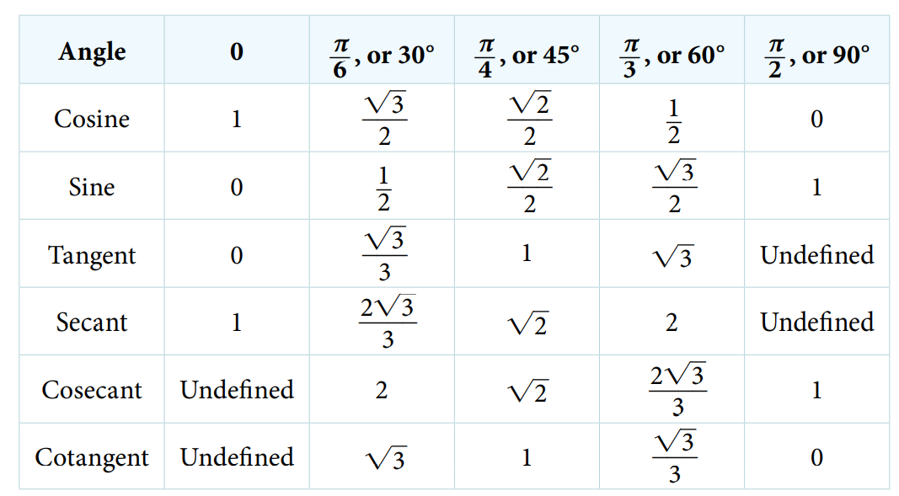
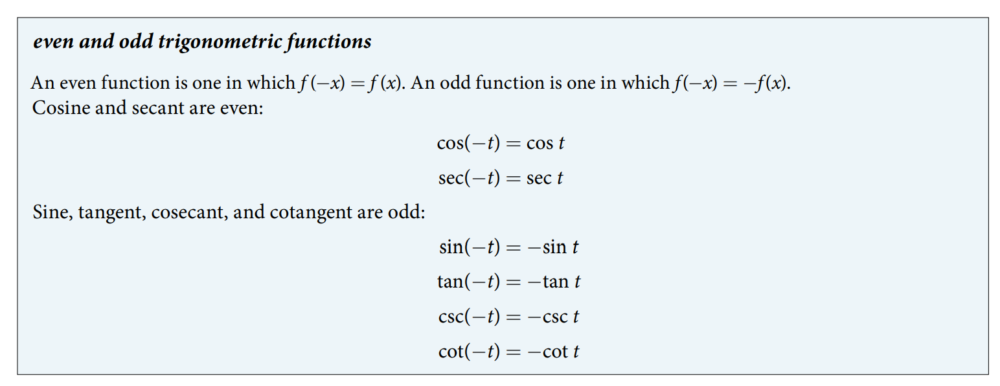
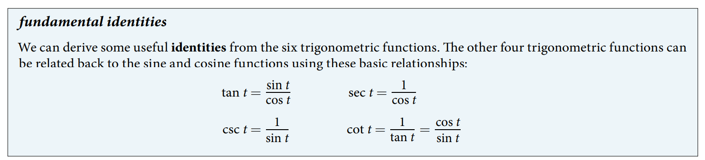
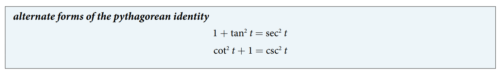
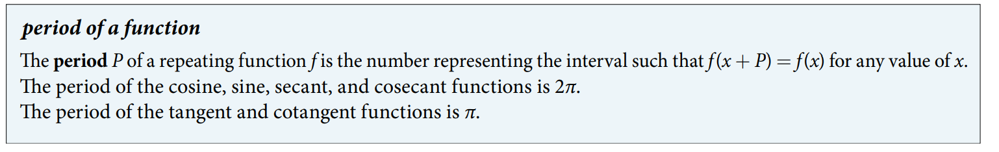

### 7.4 The Other Trigonometric Functions



- 🎯 `jupyter-lab` practice

```
# Example 2

from sympy import symbols, pi, sin, cos, tan, csc, sec, cot

t = symbols('t')

t = pi/6
t

sin(t)

cos(t)

tan(t)

csc(t)

sec(t)

cot(t)
```



- The even and odd trigonometric functions


- The fundamental identities



- 🎯 `jupyter-lab` practice

```
# Example 6

from sympy import symbols, pi, sin, cos, tan, csc, sec, cot, trigsimp

t = symbols('t')

expr = sec(t)/tan(t)
expr

trigsimp(expr)
```

- The alternate forms of the pythagorean identity


- The period of a function


- 🎯 `jupyter-lab` practice

```
# period

from sympy import symbols, pi, sin, cos, tan, csc, sec, cot

t = symbols('t')

sin(t + 2*pi)

cos(t + 2*pi)

csc(t + 2*pi)

sec(t + 2*pi)

tan(t + pi)

cot(t + pi)
```

