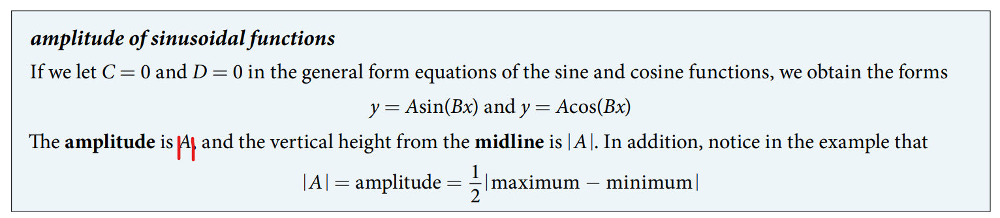

### 8.1 Graphs of the Sine and Cosine Functions

- 🎯 `jupyter-lab` practice

```
# Figure 2

%matplotlib widget
import matplotlib.pyplot as plt
import numpy as np


pi = np.pi
x = np.arange(0, 2*pi, 0.01)
y = np.sin(x)

x_sample = [0, pi/6, pi/4, pi/3, pi/2, 2*pi/3, 3*pi/4, 5*pi/6, pi]
y_sample = [0, 1/2, np.sqrt(2)/2, np.sqrt(3)/2, 1, np.sqrt(3)/2, np.sqrt(2)/2, 1/2, 0]

fig, ax = plt.subplots()
ax.plot(x, y)
ax.scatter(x_sample, y_sample, color='k')
ax.grid()
ax.set_aspect('equal', 'box')
plt.xlim(0, 2*pi)
plt.ylim(-1.5, 1.5)
```


- 🎯 `jupyter-lab` practice

```
# Figure 4

%matplotlib widget
import matplotlib.pyplot as plt
import numpy as np


pi = np.pi
x = np.arange(0, 2*pi, 0.01)
y = np.cos(x)

x_sample = [0, pi/6, pi/4, pi/3, pi/2, 2*pi/3, 3*pi/4, 5*pi/6, pi]
y_sample = [1, np.sqrt(3)/2, np.sqrt(2)/2, 1/2, 0, -1/2, -np.sqrt(2)/2, -np.sqrt(3)/2, -1]

fig, ax = plt.subplots()
ax.plot(x, y)
ax.scatter(x_sample, y_sample, color='k')
ax.grid()
ax.set_aspect('equal', 'box')
plt.xlim(0, 2*pi)
plt.ylim(-1.5, 1.5)
```


- 🎯 `jupyter-lab` practice

```
# Figure 6, 7

%matplotlib widget
import matplotlib.pyplot as plt
import numpy as np


pi = np.pi
x = np.arange(-2*pi, 2*pi, 0.01)
y1 = np.sin(x)
y2 = np.cos(x)


fig, ax = plt.subplots()
ax.plot(x, y1, x, y2, 'r')

ax.grid()
ax.set_aspect('equal', 'box')
ax.legend(labels=('$y = \sin(x)$', '$y = \cos(x)$'), loc='upper left')
plt.xlim(-2*pi, 2*pi)
plt.ylim(-3, 3)
```

- The characteristics of sine and cosine functions


- The sinusoidal function
$$y = A\sin(Bx - C) + D = A\sin\left(B\left(x - \dfrac{C}{B}\right)\right) + D, \\ y = A\cos(Bx - C) + D = A\sin\left(B\left(x - \dfrac{C}{B}\right)\right) + D $$

- The period of sinusoidal functions


- 🎯 `jupyter-lab` practice

```
# Figure 8

%matplotlib widget
import matplotlib.pyplot as plt
import numpy as np


pi = np.pi
x = np.arange(0, 2*pi, 0.01)
y1 = np.sin(x)
y2 = np.sin(2*x)
y3 = np.sin(x/2)


fig, ax = plt.subplots()
ax.plot(x, y1, x, y2, 'r', x, y3, 'g')

ax.grid()
ax.set_aspect('equal', 'box')
ax.legend(labels=('$y = \sin(x)$', '$y = \sin(2x)$', '$y = \sin(x/2)$'), loc='upper left')
plt.xlim(0, 2*pi)
plt.ylim(-3, 3)
```

- The amplitude of sinusoidal functions


- 🎯 `jupyter-lab` practice

```
# Figure 9

%matplotlib widget
import matplotlib.pyplot as plt
import numpy as np


pi = np.pi
x = np.arange(-6*pi, 6*pi, 0.01)
y1 = np.sin(x)
y2 = 2*np.sin(x)
y3 = 3*np.sin(x)
y4 = 4*np.sin(x)


fig, ax = plt.subplots()
ax.plot(x, y1, 'r', x, y2, '#1f77b4', x, y3, 'g', x, y4, 'orange')

ax.grid()
#ax.set_aspect('equal', 'box')a
ax.legend(labels=('$y = \sin(x)$', '$y = 2\sin(x)$', '$y = 3\sin(x)$', '$y = 4\sin(x)$'), loc='upper left')
plt.xlim(-6*pi, 6*pi)
plt.ylim(-10, 10)
```

- The phase shift
$$\dfrac{C}{B} $$
of the sinusoidal function
$$y =A\sin\left(B\left(x - \dfrac{C}{B}\right)\right) + D, \\ y = A\sin\left(B\left(x - \dfrac{C}{B}\right)\right) + D $$

- 🎯 `jupyter-lab` practice

```
# Figure 11

%matplotlib widget
import matplotlib.pyplot as plt
import numpy as np


pi = np.pi

x1 = np.arange(0, 2*pi, 0.01)
y1 = np.sin(x1)

x2 = np.arange(pi/4, 2*pi + pi/4, 0.01)
y2 = np.sin(x2 - pi/4)

x3 = np.arange(pi, 2*pi + pi, 0.01)
y3 = np.sin(x3 - pi)


fig, ax = plt.subplots()
ax.plot(x1, y1)
ax.plot(x2, y2, 'r')
ax.plot(x3, y3, 'g')

ax.grid()
#ax.set_aspect('equal', 'box')a
ax.legend(labels=('$y = \sin(x)$', '$y = \sin(x - \pi/4)$', '$y = \sin(x - \pi)$'), loc='upper left')
plt.xlim(0, 3*pi)
plt.ylim(-3, 3)
```


- The variations of sine and cosine functions
