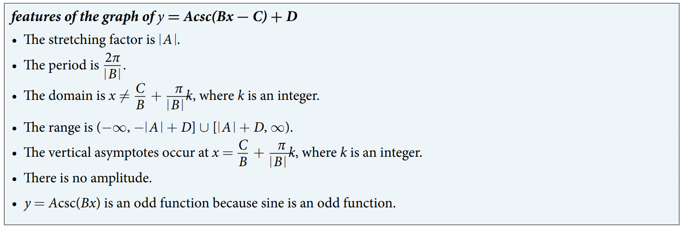
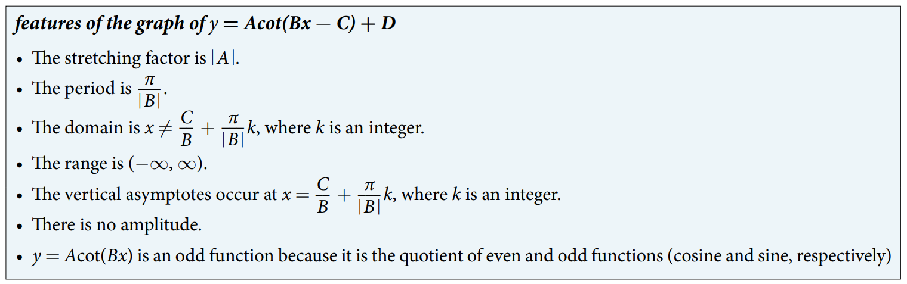

### 8.2 Graphs of Other Trigonometric Functions


- 🎯 `jupyter-lab` practice

```
# Figure 1

%matplotlib widget
import matplotlib.pyplot as plt
import numpy as np


pi = np.pi

x1 = np.arange(-3*pi/2 + 0.01, -pi/2, 0.01)
y1 = np.tan(x1)

x2 = np.arange(-pi/2 + 0.01, pi/2, 0.01)
y2 = np.tan(x2)

x3 = np.arange(pi/2 + 0.01, 3*pi/2, 0.01)
y3 = np.tan(x3)


fig, ax = plt.subplots()
ax.plot(x1, y1, x2, y2, x3, y3)

ax.scatter(-pi,0)
ax.scatter(0,0)
ax.scatter(pi,0)

ax.axvline(x = -pi/2, linestyle='--')
ax.axvline(x = pi/2, linestyle='--')
ax.axvline(x = 3*pi/2, linestyle='--')

ax.grid()
#ax.set_aspect('equal', 'box')
plt.xlim(-3*pi/2, 3*pi/2)
plt.ylim(-5, 5)
```


- 🎯 `jupyter-lab` practice

```
# Example 1

%matplotlib widget
import matplotlib.pyplot as plt
import numpy as np


pi = np.pi
A = 0.5
B = pi/2
P = pi/np.abs(B)

x = np.arange(-P/2 + 0.01, P/2, 0.01)
y = A*np.tan(B*x)


fig, ax = plt.subplots()
ax.plot(x, y)

ax.axvline(x = -P/2, color='r', linestyle='--')
ax.axvline(x = P/2, color='r', linestyle='--')
           
ax.scatter(0, 0, color='k')
ax.scatter(-P/4, -A, color='k') # quater period: P/4
ax.scatter(P/4, A, color='k') # quater period: P/4

ax.grid()
#ax.set_aspect('equal', 'box')
plt.xlim(-P/2, P/2)
plt.ylim(-5, 5)
```


- 🎯 `jupyter-lab` practice

```
# Example 2

%matplotlib widget
import matplotlib.pyplot as plt
import numpy as np

pi = np.pi
A = -2
B = pi
C = -pi
D = -1
P = pi/np.abs(B)

x = np.arange(-P/2 + C/np.abs(B) + 0.01, P/2 + C/np.abs(B), 0.01)
y = A*np.tan(B*x - C) + D


fig, ax = plt.subplots()
ax.plot(x, y)

ax.axvline(x = -P/2 + C/np.abs(B), color='r', linestyle='--')
ax.axvline(x = P/2 + C/np.abs(B), color='r', linestyle='--')
           
ax.scatter(C/B, D, color='k')
ax.scatter(-P/4 + C/B, -A + D, color='k') # quater period: P/4
ax.scatter(P/4 + C/B, A + D, color='k') # quater period: P/4

ax.grid()
#ax.set_aspect('equal', 'box')
plt.xlim(-P/2 + C/np.abs(B), P/2 + C/np.abs(B))
plt.ylim(-5 + D, 5 + D)
```


- 🎯 `jupyter-lab` practice

```
# Figure 6

%matplotlib widget
import matplotlib.pyplot as plt
import numpy as np

pi = np.pi

x = np.arange(-2*pi, 2*pi, 0.01)
y = np.cos(x)

x1 = np.arange(-2*pi + 0.01, -3*pi/2, 0.01)
y1 = 1/np.cos(x1) # numpy doesn't have sec()

x2 = np.arange(-3*pi/2 + 0.01, -pi/2, 0.01)
y2 = 1/np.cos(x2)

x3 = np.arange(-pi/2 + 0.01, pi/2, 0.01)
y3 = 1/np.cos(x3)

x4 = np.arange(pi/2 + 0.01, 3*pi/2, 0.01)
y4 = 1/np.cos(x4)

x5 = np.arange(3*pi/2 + 0.01, 2*pi, 0.01)
y5 = 1/np.cos(x5)

fig, ax = plt.subplots()
ax.plot(x, y, x1, y1, 'g', x2, y2, 'g', x3, y3, 'g', x4, y4, 'g', x5, y5, 'g')

ax.axvline(x = -3*pi/2, color='r', linestyle='--')
ax.axvline(x = -pi/2, color='r', linestyle='--')
ax.axvline(x = pi/2, color='r', linestyle='--')
ax.axvline(x = 3*pi/2, color='r', linestyle='--')

ax.grid()
#ax.set_aspect('equal', 'box')
plt.xlim(-2*pi, 2*pi)
plt.ylim(-10, 10)
```


- 🎯 `jupyter-lab` practice

```
# Figure 7

%matplotlib widget
import matplotlib.pyplot as plt
import numpy as np

pi = np.pi

x = np.arange(-2*pi, 2*pi, 0.01)
y = np.sin(x)

x1 = np.arange(-2*pi + 0.01, -pi, 0.01)
y1 = 1/np.sin(x1) # numpy doesn't have csc()

x2 = np.arange(-pi + 0.01, 0, 0.01)
y2 = 1/np.sin(x2)

x3 = np.arange(0 + 0.01, pi, 0.01)
y3 = 1/np.sin(x3)

x4 = np.arange(pi + 0.01, 2*pi, 0.01)
y4 = 1/np.sin(x4)


fig, ax = plt.subplots()
ax.plot(x, y, x1, y1, 'g', x2, y2, 'g', x3, y3, 'g', x4, y4, 'g')

ax.axvline(x = -2*pi, color='r', linestyle='--')
ax.axvline(x = -pi, color='r', linestyle='--')
ax.axvline(x = 0, color='r', linestyle='--')
ax.axvline(x = pi, color='r', linestyle='--')
ax.axvline(x = 2*pi, color='r', linestyle='--')

ax.grid()
#ax.set_aspect('equal', 'box')
plt.xlim(-2*pi, 2*pi)
plt.ylim(-10, 10)
```





- 🎯 `jupyter-lab` practice

```
# Figure 13

%matplotlib widget
import matplotlib.pyplot as plt
import numpy as np

pi = np.pi

x1 = np.arange(-2*pi + 0.01, -pi, 0.01)
y1 = 1/np.tan(x1) # numpy doesn't have cot()

x2 = np.arange(-pi + 0.01, 0, 0.01)
y2 = 1/np.tan(x2)

x3 = np.arange(0 + 0.01, pi, 0.01)
y3 = 1/np.tan(x3)

x4 = np.arange(pi + 0.01, 2*pi, 0.01)
y4 = 1/np.tan(x4)


fig, ax = plt.subplots()
ax.plot(x1, y1, 'g', x2, y2, 'g', x3, y3, 'g', x4, y4, 'g')

ax.scatter(-3*pi/2, 0, color='k')
ax.scatter(-pi/2, 0, color='k')
ax.scatter(pi/2, 0, color='k')
ax.scatter(3*pi/2, 0, color='k')

ax.axvline(x = -2*pi, color='r', linestyle='--')
ax.axvline(x = -pi, color='r', linestyle='--')
ax.axvline(x = 0, color='r', linestyle='--')
ax.axvline(x = pi, color='r', linestyle='--')
ax.axvline(x = 2*pi, color='r', linestyle='--')

ax.grid()
#ax.set_aspect('equal', 'box')
plt.xlim(-2*pi, 2*pi)
plt.ylim(-10, 10)
```



