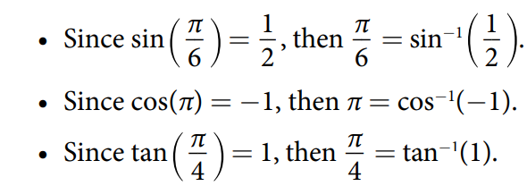
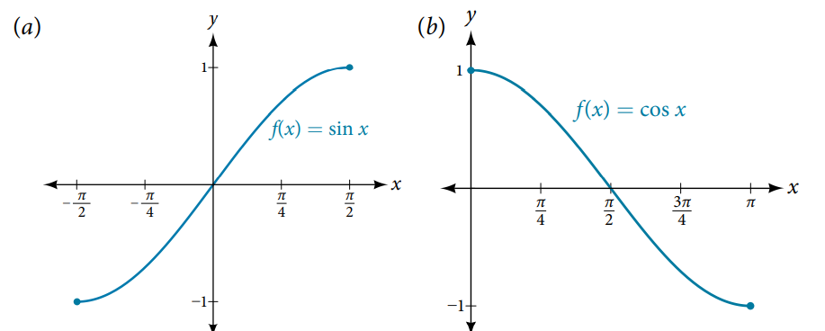
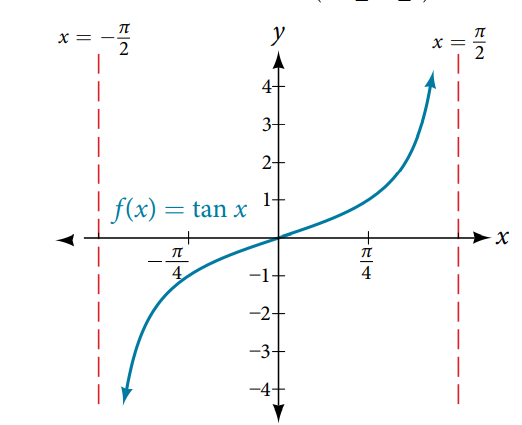
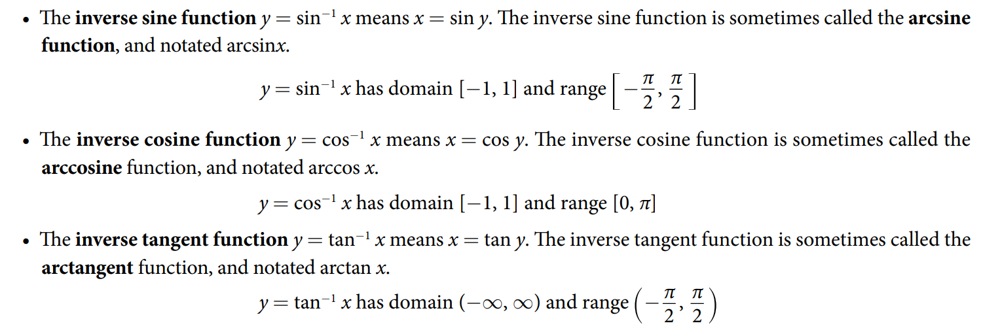
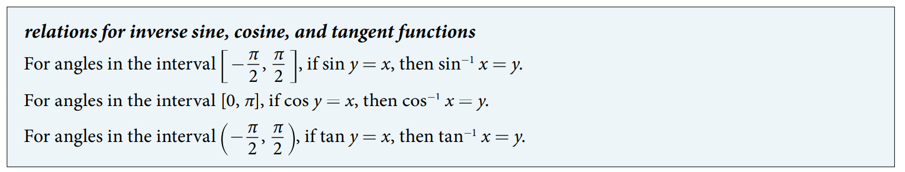
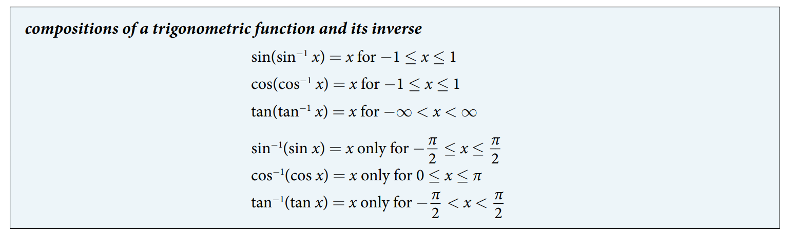

### 8.3 Inverse Trigonometric Functions

- The notational convention of the inverse of trigonometry functions, for example,
$$ y = \sin^{-1}(x) $$



- Only consider on the domain where one-to-one






- 🎯 `jupyter-lab` practice

```
# Figure 4


%matplotlib widget
import matplotlib.pyplot as plt
import numpy as np

pi = np.pi

x1 = np.arange(-pi/2, pi/2, 0.01)
y1 = np.sin(x1)

x2 = np.arange(-1, 1, 0.01)
y2 = np.arcsin(x2)


fig, ax = plt.subplots()
ax.plot(x1, y1, x2, y2, 'r')
ax.axline((0,0), (1,1), color='g', linestyle='--')

ax.grid()
ax.set_aspect('equal', 'box')
ax.legend(labels=('$y = \sin(x)$', '$y = \sin^{-1}(x)$'), loc='upper left')
plt.xlim(-pi/2, pi/2)
plt.ylim(-pi/2, pi/2)
```



- 🎯 `jupyter-lab` practice

```
# Figure 5


%matplotlib widget
import matplotlib.pyplot as plt
import numpy as np

pi = np.pi

x1 = np.arange(0, pi, 0.01)
y1 = np.cos(x1)

x2 = np.arange(-1, 1, 0.01)
y2 = np.arccos(x2)


fig, ax = plt.subplots()
ax.plot(x1, y1, x2, y2, 'r')
ax.axline((0,0), (1,1), color='g', linestyle='--')

ax.grid()
ax.set_aspect('equal', 'box')
ax.legend(labels=('$y = \cos(x)$', '$y = \cos^{-1}(x)$'), loc='lower left')
plt.xlim(-pi/2, pi)
plt.ylim(-pi/2, pi)
```

- 🎯 `jupyter-lab` practice

```
# Figure 6


%matplotlib widget
import matplotlib.pyplot as plt
import numpy as np

pi = np.pi

x = np.arange(-pi/2, pi/2, 0.01)
y1 = np.tan(x)
y2 = np.arctan(x)


fig, ax = plt.subplots()
ax.plot(x, y1, x, y2, 'r')
ax.axline((0,0), (1,1), color='g', linestyle='--')

ax.grid()
ax.set_aspect('equal', 'box')
ax.legend(labels=('$y = tan(x)$', '$y = tan^{-1}(x)$'), loc='lower right')
plt.xlim(-pi/2, pi/2)
plt.ylim(-pi/2, pi/2)
```

- 🎯 `jupyter-lab` practice

```
# Example 1

from sympy import pi, sin, asin

y = sin(5*pi/12)
y

y.evalf()

x = asin(y)
x

x.evalf()
```

- 🎯 `jupyter-lab` practice

```
# Example 2

from sympy import pi, sqrt, Rational, asin, acos, atan

asin(Rational(1,2))

asin(-sqrt(2)/2)

acos(-sqrt(3)/2)

atan(1)
```

- 🎯 `jupyter-lab` practice

```
# Example 4

from sympy import symbols, Rational, cos, acos, pi

theta = symbols('theta')

theta = acos(Rational(9,12))
theta

theta_rad = theta.evalf() # in radians
theta_rad

theta_deg = (theta * 180/pi).evalf() # in degree
theta_deg
```




