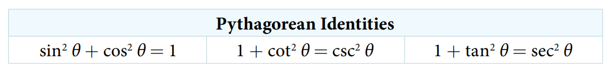
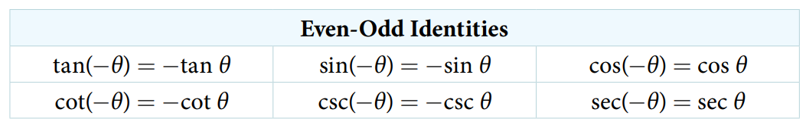
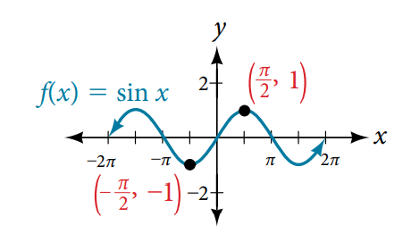
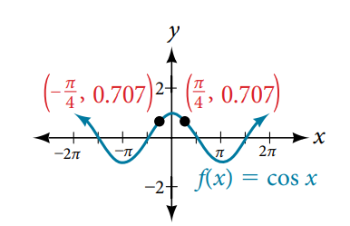

### 9.1 Solving Trigonometric Equations with Identities


> See proof








- 🎯 `jupyter-lab` practice

```
# Example 2

from sympy import symbols, sin, cos, tan, trigsimp

theta = symbols('theta')

trigsimp(tan(theta)*cos(theta))
```

- 🎯 `jupyter-lab` practice

```
# Example 10

from sympy import symbols, csc, cot, trigsimp

trigsimp(csc(theta)**2 - cot(theta)**2)
```