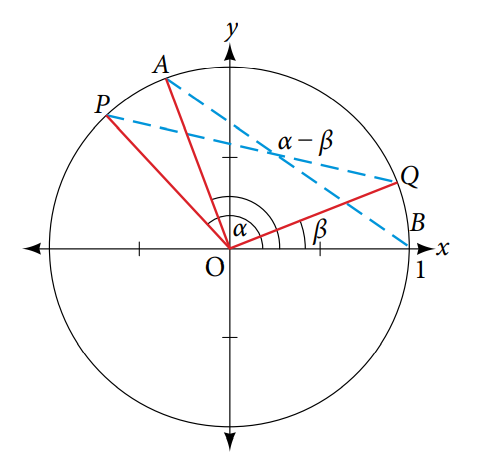
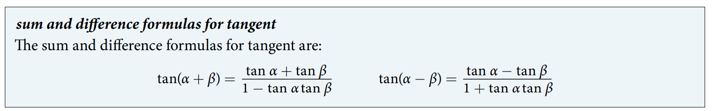

### 9.2 Sum and Difference Identities


> See proof



- 🎯 `jupyter-lab` practice

```
# Verifing the proof

from sympy import symbols, sin, cos, expand_trig, trigsimp

alpha, beta = symbols('alpha, beta')

expr = cos(alpha + beta)
expr

expand_trig(expr)

expr2 = cos(alpha)*cos(beta) - sin(alpha)*sin(beta)
expr2

trigsimp(expr2)

expr3 = expr.subs(beta, -beta)
expr3

expand_trig(expr3)

expr4 = expr2.subs(beta, -beta)
expr4

trigsimp(expr4)
```


- [proof](https://www.math-only-math.com/proof-of-compound-angle-formula-sin-alpha-plus-beta.html)
- [Youtube - Proof: sin(a+b) = (cos a)(sin b) + (sin a)(cos b)](https://www.youtube.com/watch?v=zw0waJCEc-w)

- 🎯 `jupyter-lab` practice

```
# verifying proof

from sympy import symbols, sin, cos, expand_trig, trigsimp, pi

alpha, beta = symbols('alpha, beta')

expr = sin(alpha + beta)
expr

expand_trig(expr)

expr2 = sin(alpha)*cos(beta) + cos(alpha)*sin(beta)
expr2

trigsimp(expr2)

expr3 = expr.subs(beta, -beta)
expr3

expand_trig(expr3)

expr4 = expr2.subs(beta, -beta)
expr4

trigsimp(expr4)
```


- 🎯 `jupyter-lab` practice

```
# Example 4

from sympy import Rational, sin, asin, acos, trigsimp 

expr = sin(acos(Rational(1,2)) + asin(Rational(3,5)))
expr

trigsimp(expr)
```


> See proof


> See proof

- Some useful trigonometry identities
$$ \sin(\alpha + \beta) + \sin(\alpha - \beta) = 2\sin\alpha\cos\beta \\
\dfrac{\sin(\alpha - \beta)}{\cos\alpha \cos\beta} = \tan\alpha - \tan\beta
$$

- Example 10

$$ \tan \theta = \dfrac{m_2 - m_1}{1 + m_2 m_1} $$


- 🎯 `jupyter-lab` practice

```
# Example 11

from sympy import symbols, pi, atan, Rational

alpha, beta = symbols('alpha, beta')

beta = atan(Rational(47, 50))
beta

alpha = beta - atan(Rational(40, 50))
alpha

alpha_rad = alpha.evalf()
alpha_rad

alpha_deg = (alpha_rad*180/pi).evalf()
alpha_deg
```