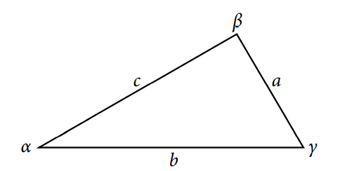
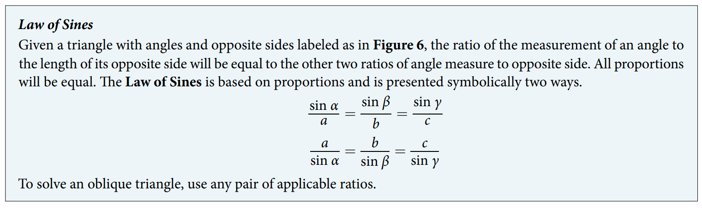
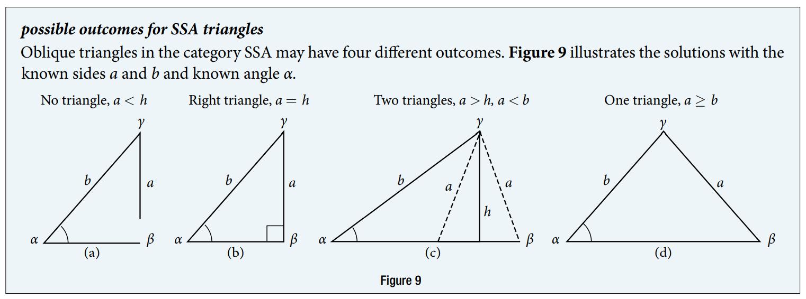
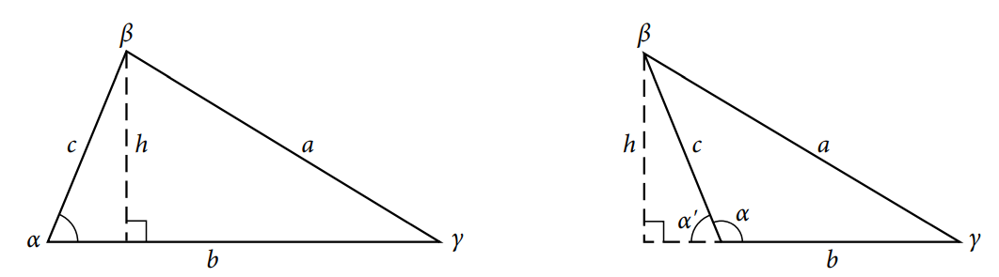
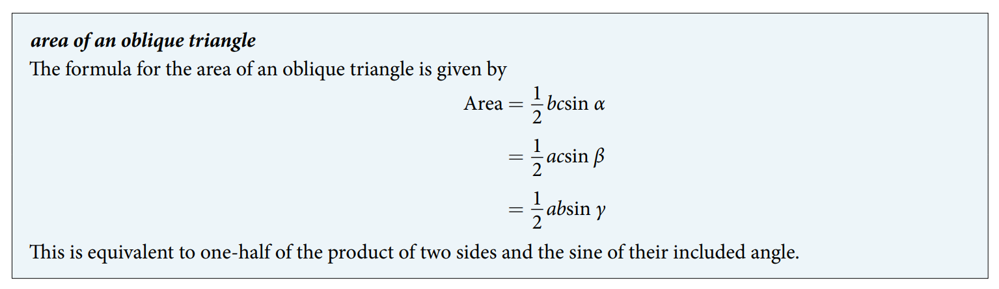

### 10.1 Non-right Triangles: Law of Sines



> See proof

- [Proof: Law of sines](https://www.youtube.com/watch?v=APNkWrD-U1k)

- 🎯 `jupyter-lab` practice

```
# Example 1

from sympy import symbols, pi, sin, Eq, solveset

alpha, beta, gamma = symbols('alpha, beta, gamma')

a, b, c = symbols('a, b, c')

alpha = 50 # in degree
alpha

gamma = 30 # in degree
gamma

a = 10

beta = 180 - alpha - gamma # in degree
beta

expr = Eq(sin(alpha*pi/180)/a, sin(gamma*pi/180)/c) # in radians
expr

sol = solveset(expr, c)
sol

c_numeric = sol.evalf()
c_numeric

sol2 = solveset(expr2, b)
sol2

b_numeric = sol2.evalf()
b_numeric
```



- 🎯 `jupyter-lab` practice

```
# Example 2

from sympy import symbols, pi, sin, asin

alpha, beta, gamma = symbols('alpha, beta, gamma')

a, b, c = symbols('a, b, c')

alpha = 35 # in degree
alpha

a = 6

b = 8

beta_prime = asin((sin(alpha*pi/180)/a)*b)*180/pi # the acute angle in degree
beta_prime.evalf()

beta = 180 - beta_prime # the obtuse angle in degree
beta.evalf()

gamma = 180 - alpha - beta
gamma.evalf()

gamma_prime = 180 - alpha - beta_prime
gamma_prime

c = (a/sin(alpha*pi/180))*sin(gamma*pi/180)
c.evalf()

c_prime = (a/sin(alpha*pi/180))*sin(gamma_prime*pi/180)
c_prime.evalf()
```



> See proof