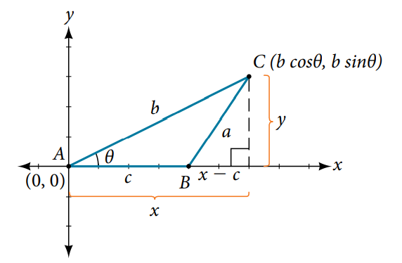
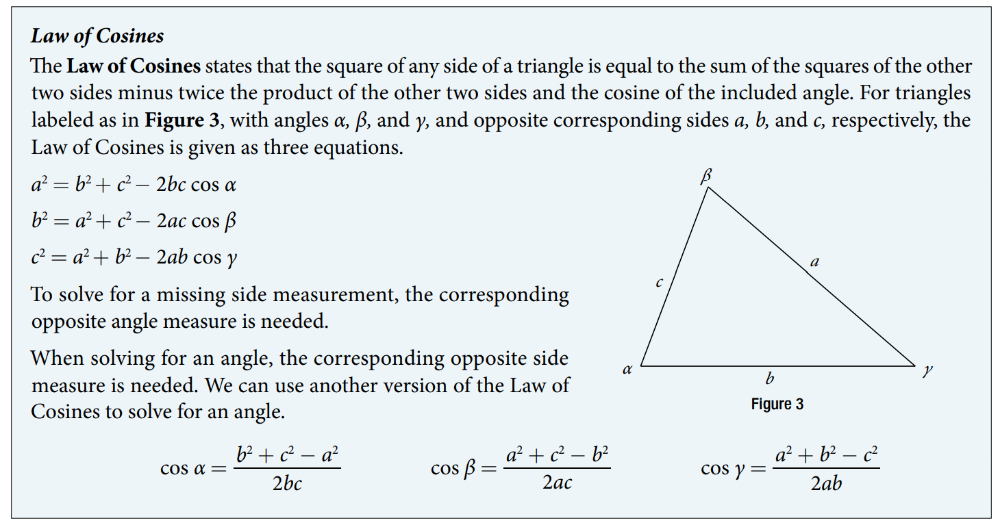
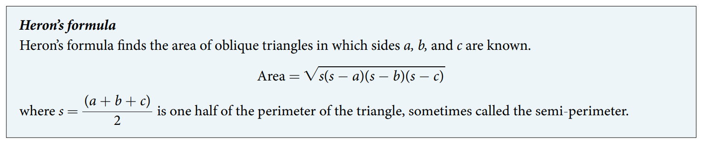

### 10.2 Non-right Triangles: Law of Cosines



> See proof

- [Proof of the law of cosines](https://www.youtube.com/watch?v=pGaDcOMdw48)

- 🎯 `jupyter-lab` practice

```
# Example 1

from sympy import symbols, pi, sqrt, sin , cos, asin

alpha, beta, gamma = symbols('alpha, beta, gamma')

a, b, c = symbols('a, b, c')

a = 10

c = 12

beta = 30 # in degree

b = sqrt( a**2 + c**2 - 2*a*c*cos(beta*pi/180))
b.evalf()

alpha = asin( sin(beta*pi/180)/b * a )  * 180/pi # in degree
alpha.evalf()

gamma = 180 - alpha - beta # in degree
gamma.evalf()
```


- 🎯 `jupyter-lab` practice

```
# Example 2

from sympy import symbols, pi, acos

alpha, beta, gamma = symbols('alpha, beta, gamma')

a, b, c = symbols('a, b, c')

a = 20

b = 25

c = 18

alpha = acos( (b**2 + c**2 - a**2)/(2*b*c)  ) * 180/pi  # in degree
alpha.evalf()
```



- [Part 1 of proof of Heron's formula](https://www.youtube.com/watch?v=AreOMvPCxv8)
- [Part 2 of proof of Heron's formula](https://www.youtube.com/watch?v=nZu7IZLhJRI)