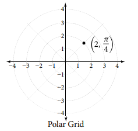
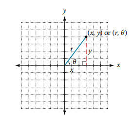
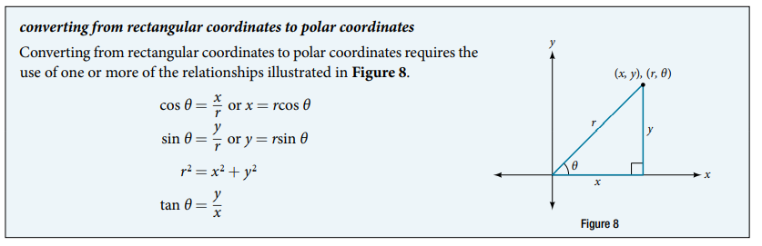

### 10.3 Polar Coordinates

- The polar coordinates
$$ (r, \theta) $$ 


- 🎯 `jupyter-lab` practice

```
# Example 1

%matplotlib widget
import matplotlib.pyplot as plt
import numpy as np

theta = np.pi/2
r = 3

fig, ax = plt.subplots(subplot_kw={'projection': 'polar'})
ax.scatter(theta, r)
ax.set_rmin(0)
ax.set_rmax(4)
ax.set_rticks(range(0, 5))
ax.set_rlabel_position(-22.5)
ax.grid(True)
```

- 🎯 `jupyter-lab` practice

```
# Example 2

%matplotlib widget
import matplotlib.pyplot as plt
import numpy as np

theta = np.pi/6
r = -2

if r < 0:
    r *= -1
    if theta >= 0:
        theta += np.pi
    else:
        theta -= np.pi
        
fig, ax = plt.subplots(subplot_kw={'projection': 'polar'})
ax.scatter(theta, r)
ax.set_rmin(0)
ax.set_rmax(4)
ax.set_rticks(range(0, 5))
ax.set_rlabel_position(-22.5)
ax.grid(True)
```

- 🎯 `jupyter-lab` practice

```
# Example 3

from sympy import symbols, pi, cos, sin

r, theta = symbols('r, theta')

r = 3
theta = pi/2

x = r*cos(theta)
y = r*sin(theta)

(x, y)
```

- 🎯 `jupyter-lab` practice

```
# Figure 6 (Polar Grid)

%matplotlib widget
import matplotlib.pyplot as plt
import numpy as np

theta = np.pi/2
r = 3

if r < 0:
    r *= -1
    if theta >= 0:
        theta += np.pi
    else:
        theta -= np.pi
        
fig, ax = plt.subplots(subplot_kw={'projection': 'polar'})
ax.scatter(theta, r)
ax.set_rmin(0)
ax.set_rmax(4)
ax.set_rticks(range(0, 5))
ax.set_rlabel_position(-22.5)
ax.grid(True)
```

- 🎯 `jupyter-lab` practice

```
# Example 4

from sympy import symbols, pi, cos, sin

r, theta = symbols('r, theta')

r = -2
theta = 0

x = r*cos(theta)
y = r*sin(theta)

(x, y)
```

- 🎯 `jupyter-lab` practice

```
# Figure 7 (Polar Grid)

%matplotlib widget
import matplotlib.pyplot as plt
import numpy as np

theta = 0
r = -2

if r < 0:
    r *= -1
    if theta >= 0:
        theta += np.pi
    else:
        theta -= np.pi
        
fig, ax = plt.subplots(subplot_kw={'projection': 'polar'})
ax.scatter(theta, r)
ax.set_rmin(0)
ax.set_rmax(4)
ax.set_rticks(range(0, 5))
ax.set_rlabel_position(-22.5)
ax.grid(True)
```




- 🎯 `jupyter-lab` practice

```
# Example 5

from sympy import symbols, sqrt, Rational, atan

x, y = symbols('x, y')
r, theta = symbols('r, theta')

x = 3
y = 3

r = sqrt(x**2 + y**2)
r

theta = atan(Rational(y, x))
theta
```

- 🎯 `jupyter-lab` practice

```
# Figure 9 (Polar Grid) - Analysis

%matplotlib widget
import matplotlib.pyplot as plt
import numpy as np

theta_list = [np.pi/4, 5*np.pi/4, -7*np.pi/4]
r_list = [3*np.sqrt(2), -3*np.sqrt(2), 3*np.sqrt(2)]

for i in range(0, len(theta_list)):
    r = r_list[i]
    theta = theta_list[i]
    if r < 0:
        r_list[i] *= -1
        if theta >= 0:
            theta_list[i] += np.pi
        else:
            theta_list[i] -= np.pi
        
fig, ax = plt.subplots(subplot_kw={'projection': 'polar'})
ax.scatter(theta_list, r_list)
ax.set_rmin(0)
ax.set_rmax(5)
ax.set_rticks(range(0, 6))
ax.set_rlabel_position(-22.5)
ax.grid(True)
```


- 🎯 `jupyter-lab` practice

```
# Example 6

from sympy import symbols, cos, sin, trigsimp, Eq, solveset

x, y = symbols('x, y')
r, theta = symbols('r, theta')

expr = Eq(x**2 + y**2, 9)
expr

expr2 = expr.subs({x: r*cos(theta), y: r*sin(theta)})
expr2

trigsimp(expr2)

solveset(expr2, r)
```

- 🎯 `jupyter-lab` practice

```
# Figure 10 (a)

%matplotlib widget
import matplotlib.pyplot as plt
import numpy as np

x = np.arange(-3, 3, 0.0001)
y1 = np.sqrt(9 - x**2)
y2 = -y1

fig, ax = plt.subplots()
ax.plot(x, y1, x, y2)
ax.set_aspect('equal', 'box')
ax.grid()
ax.set_xlim(-4, 4)
ax.set_ylim(-4, 4)
```

- 🎯 `jupyter-lab` practice

```
# Figure 10 (b)

%matplotlib widget
import matplotlib.pyplot as plt
import numpy as np

theta_list = np.arange(0, 2*np.pi, 0.01)
r_list = [3]*len(theta_list)

for i in range(0, len(theta_list)):
    r = r_list[i]
    theta = theta_list[i]
    if r < 0:
        r_list[i] *= -1
        if theta >= 0:
            theta_list[i] += np.pi
        else:
            theta_list[i] -= np.pi
            
fig, ax = plt.subplots(subplot_kw={'projection': 'polar'})
ax.plot(theta_list, r_list)
ax.set_rmin(0)
ax.set_rmax(4)
ax.set_rticks(range(0, 5))
ax.set_rlabel_position(-22.5)
ax.grid(True)
```

- 🎯 `jupyter-lab` practice

```
# Example 7

from sympy import symbols, sin, cos, Eq, solveset

x, y = symbols('x, y')

r, theta = symbols('r, theta')

expr = Eq(x**2 + y**2, 6*y)
expr

expr2 = expr.subs({x: r*cos(theta), y:r*sin(theta)})
expr2

sols = solveset(expr2, r)
sols
```

- 🎯 `jupyter-lab` practice

```
# Figure 11 (a)

%matplotlib widget
import matplotlib.pyplot as plt
import numpy as np

x = np.arange(-3, 3, 0.0001)
y1 = 3 + np.sqrt(9 - x**2)
y2 = 3 - np.sqrt(9 - x**2)

fig, ax = plt.subplots()
ax.plot(x, y1, x, y2)
ax.set_aspect('equal', 'box')
ax.grid(True)
ax.set_xlim(-6, 6)
ax.set_ylim(-1, 7)
```
- 🎯 `jupyter-lab` practice

```
# Figure 11 (b)

%matplotlib widget
import matplotlib.pyplot as plt
import numpy as np

theta_list = np.arange(0, 2*np.pi, 0.01)
r_list = 6*np.sin(theta_list)

for i in range(0, len(theta_list)):
    r = r_list[i]
    theta = theta_list[i]
    if r < 0:
        r_list[i] *= -1
        if theta >= 0:
            theta_list[i] += np.pi
        else:
            theta_list[i] -= np.pi
            
fig, ax = plt.subplots(subplot_kw={'projection': 'polar'})
ax.plot(theta_list, r_list)
ax.set_rmin(0)
ax.set_rmax(7)
ax.set_rticks(range(0, 7))
ax.set_rlabel_position(-22.5)
ax.grid(True)
```

- 🎯 `jupyter-lab` practice

```
# Example 8 

from sympy import symbols, sin, cos, Eq, solveset

x, y = symbols('x, y')
r, theta = symbols('r, theta')

x = r*cos(theta)
y = r*sin(theta)

expr = Eq(y, 3*x + 2)
expr

solveset(expr, r)

denom_zero = Eq(sin(theta), 3*cos(theta))
denom_zero

solveset(denom_zero, theta)
```

- 🎯 `jupyter-lab` practice

```
# Example 8 (plot)

%matplotlib widget
import matplotlib.pyplot as plt
import numpy as np

theta_list = np.arange(0, 2*np.pi, 0.01)
r_list = 2/(np.sin(theta_list) - 3*np.cos(theta_list))

for i in range(0, len(theta_list)):
    r = r_list[i]
    theta = theta_list[i]
    if r < 0:
        r_list[i] *= -1
        if theta >= 0:
            theta_list[i] += np.pi
        else:
            theta_list[i] -= np.pi
            
fig, ax = plt.subplots(subplot_kw={'projection': 'polar'})
ax.plot(theta_list, r_list)
ax.set_rmin(0)
ax.set_rmax(7)
ax.set_rticks(range(0, 7))
ax.set_rlabel_position(-22.5)
ax.grid(True)
```

- 🎯 `jupyter-lab` practice

```
# Example 9

from sympy import symbols, cos, sec, Eq, trigsimp

r, theta = symbols('r, theta')

expr = Eq(r*cos(theta), trigsimp(2*sec(theta)*cos(theta)))
expr

expr2 = expr.subs(r*cos(theta), x)
expr2
```


- 🎯 `jupyter-lab` practice

```
# Figure 12 (a)

%matplotlib widget
import matplotlib.pyplot as plt
import numpy as np

theta_list = np.arange(0, 2*np.pi, 0.01)
r_list = 2/np.cos(theta_list)

for i in range(0, len(theta_list)):
    r = r_list[i]
    theta = theta_list[i]
    if r < 0:
        r_list[i] *= -1
        if theta >= 0:
            theta_list[i] += np.pi
        else:
            theta_list[i] -= np.pi
            
fig, ax = plt.subplots(subplot_kw={'projection': 'polar'})
ax.plot(theta_list, r_list)
ax.set_rmin(0)
ax.set_rmax(5)
ax.set_rticks(range(0, 6))
ax.set_rlabel_position(-22.5)
ax.grid(True)
```


- 🎯 `jupyter-lab` practice

```
# Example 10

```


- Note on Example 13
We need two equations
$$ r = \dfrac{3}{1 - 2 \cos \theta}, \; \theta \in \left(\dfrac{\pi}{3}, \dfrac{5\pi}{3} \right) \\
r = \dfrac{-3}{1 + 2 \cos \theta}, \; \theta \in \left(\dfrac{2\pi}{3}, \dfrac{4\pi}{3} \right)
$$
since $x = \dfrac{\cos\theta}{r} = \dfrac{-\cos\theta}{-r}$. The $\theta$ must be in the interval where $r$ is positive to draw in a polar plot.


- 🎯 `jupyter-lab` practice

```
# Figure 13 (Cartesian grid)

%matplotlib widget
import matplotlib.pyplot as plt
import numpy as np

x1 = np.arange(-5, -3, 0.0001)
x2 = np.arange(-1, 5, 0.01)
y1plus = np.sqrt((3 + 2*x1)**2 - x1**2)
y1minus = -np.sqrt((3 + 2*x1)**2 - x1**2)
y2plus = np.sqrt((3 + 2*x2)**2 - x2**2)
y2minus = -np.sqrt((3 + 2*x2)**2 - x2**2)

fig, ax = plt.subplots()
ax.plot(x1, y1plus, x1, y1minus, x2, y2plus, x2, y2minus)
ax.set_xlim(-5, 5)
ax.set_ylim(-5, 5)
ax.grid(True)
```

- 🎯 `jupyter-lab` practice

```
# Figure 13 (polar grid)

%matplotlib widget
import matplotlib.pyplot as plt
import numpy as np

theta1 = np.arange(np.pi/3 + 0.01, 5*np.pi/3, 0.01) # do not include pi/3 which makes denominator zero
theta2 = np.arange(2*np.pi/3 + 0.01, 4*np.pi/3, 0.01) # do not include 4*pi/6 which makes denominator zero

# Note: x = r * cos(theta) or x = (-r)*(-cos(theta))

r1 = 3/(1 - 2*np.cos(theta1))
r2 = -3/(1 + 2*np.cos(theta2))  

fig, ax = plt.subplots(subplot_kw={'projection': 'polar'})
ax.plot(theta1, r1)
ax.plot(theta2, r2)
ax.set_rmax(6)
ax.set_rticks(range(0, 6))
ax.set_rlabel_position(-22.5)
ax.grid(True)
```