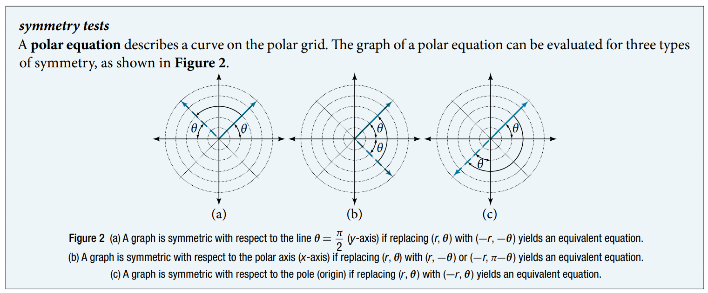
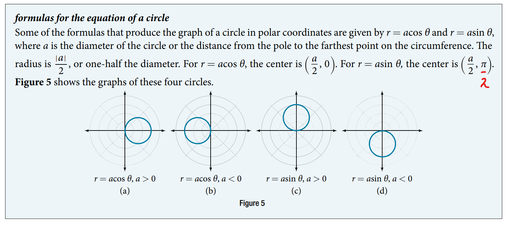
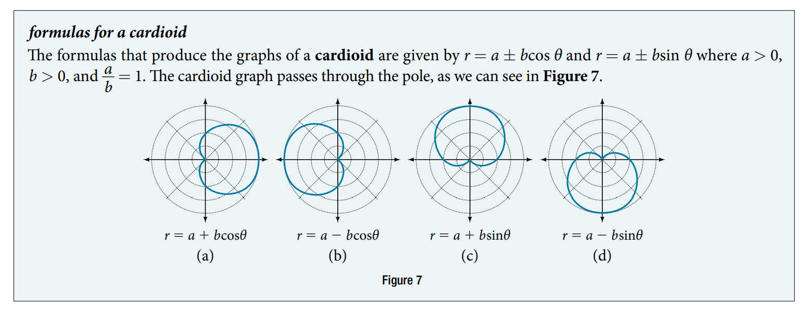
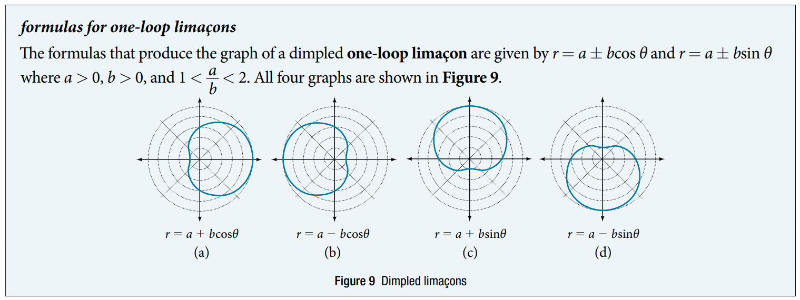
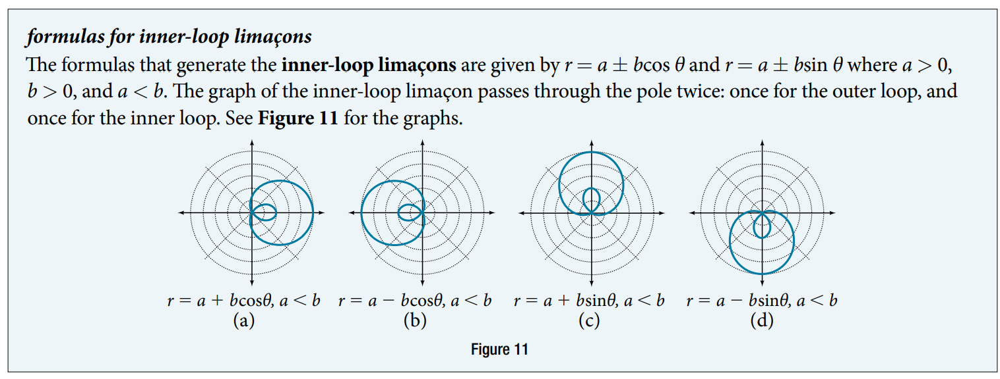
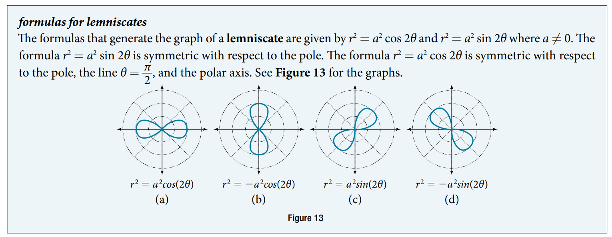
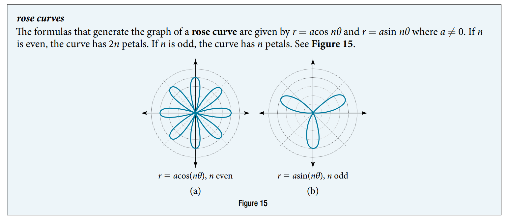
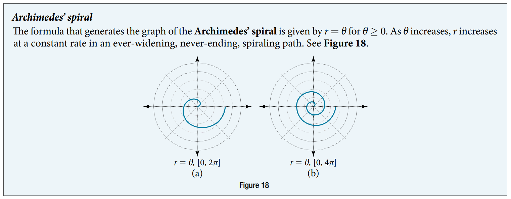

### 10.4 Polar Coordinates: Graphs



- 🎯 `jupyter-lab` practice

```
# Example 1, 2

%matplotlib widget
import matplotlib.pyplot as plt
import numpy as np

theta = np.arange(0, 2*np.pi, 0.01)
r = 2*np.sin(theta)

fig, ax = plt.subplots(subplot_kw={'projection': 'polar'})
ax.plot(theta, r)
ax.set_rmin(0)
ax.set_rmax(4)
ax.set_rticks(range(0, 5))
ax.set_rlabel_position(-22.5)
ax.grid(True)
```



- 🎯 `jupyter-lab` practice

```
# Example 3

%matplotlib widget
import matplotlib.pyplot as plt
import numpy as np

pi = np.pi
theta = np.arange(0, 2*np.pi, 0.01)
r = 4*np.cos(theta)

def rad(ang):
    return 4*np.cos(ang)

theta_sample = [0, pi/6, pi/4, pi/3, pi/2, 2*pi/3, 3*pi/4, 5*pi/6, pi]
r_sample = [rad(theta_sample)]

print(r_sample)

fig, ax = plt.subplots(subplot_kw={'projection': 'polar'})
ax.plot(theta, r)
ax.scatter(theta_sample, r_sample, color='k')
ax.set_rmin(0)
ax.set_rmax(5)
ax.set_rticks(range(0, 6))
ax.set_rlabel_position(-22.5)
ax.grid(True)
```



- 🎯 `jupyter-lab` practice

```
# Example 4

%matplotlib widget
import matplotlib.pyplot as plt
import numpy as np

pi = np.pi
theta = np.arange(0, 2*np.pi, 0.01)
r = 2 + 2*np.cos(theta)

def rad(ang):
    return 2 + 2*np.cos(ang)

theta_sample = [0, pi/4, pi/2, 2*pi/3,pi]
r_sample = [rad(theta_sample)]

print(r_sample)

fig, ax = plt.subplots(subplot_kw={'projection': 'polar'})
ax.plot(theta, r)
ax.scatter(theta_sample, r_sample, color='k')
ax.set_rmin(0)
ax.set_rmax(5)
ax.set_rticks(range(0, 6))
ax.set_rlabel_position(-22.5)
ax.grid(True)
```




- 🎯 `jupyter-lab` practice

```
# Example 5

%matplotlib widget
import matplotlib.pyplot as plt
import numpy as np

pi = np.pi
theta = np.arange(0, 2*np.pi, 0.01)
r = 4 - 3*np.sin(theta)

def rad(ang):
    return 4 - 3*np.sin(ang)

theta_sample = [0, pi/2, pi, 3*pi/2]
r_sample = [rad(theta_sample)]

print(r_sample)

fig, ax = plt.subplots(subplot_kw={'projection': 'polar'})
ax.plot(theta, r)
ax.scatter(theta_sample, r_sample, color='k')
ax.set_rmin(0)
ax.set_rmax(8)
ax.set_rticks(range(0, 9))
ax.set_rlabel_position(-22.5)
ax.grid(True)
```



- 🎯 `jupyter-lab` practice

```
# Example 6 (fail)

%matplotlib widget
import matplotlib.pyplot as plt
import numpy as np

pi = np.pi
theta = np.arange(0, 2*np.pi, 0.01)
r = 2 + 5*np.cos(theta)

def rad(ang):
    return 2 + 5*np.cos(ang)

theta_sample = [0, pi/2, pi, 3*pi/2]
r_sample = [rad(theta_sample)]

print(r_sample)

fig, ax = plt.subplots(subplot_kw={'projection': 'polar'})
ax.plot(theta, r)
ax.scatter(theta_sample, r_sample, color='k')
ax.set_rmin(0)
ax.set_rmax(8)
ax.set_rticks(range(0, 9))
ax.set_rlabel_position(-22.5)
ax.grid(True)
```



- 🎯 `jupyter-lab` practice

```
# Example 7 (fail)

```



- 🎯 `jupyter-lab` practice

```
# Example 8 (fail)

%matplotlib widget
import matplotlib.pyplot as plt
import numpy as np

pi = np.pi
theta = np.arange(0, 2*np.pi, 0.01)
r = 2*np.cos(4*theta)

fig, ax = plt.subplots(subplot_kw={'projection': 'polar'})
ax.plot(theta, r)

ax.set_rmin(0)
ax.set_rmax(2)
ax.set_rticks(range(0, 3))
ax.set_rlabel_position(-22.5)
ax.grid(True)
```

```
# Example 9 (fail)

%matplotlib widget
import matplotlib.pyplot as plt
import numpy as np

pi = np.pi
theta = np.arange(0, 2*np.pi, 0.01)
r = 2*np.sin(5*theta)

fig, ax = plt.subplots(subplot_kw={'projection': 'polar'})
ax.plot(theta, r)

ax.set_rmin(0)
ax.set_rmax(4)
ax.set_rticks(range(0, 5))
ax.set_rlabel_position(-22.5)
ax.grid(True)
```



- 🎯 `jupyter-lab` practice

```
# Example 10 (fail)

%matplotlib widget
import matplotlib.pyplot as plt
import numpy as np

pi = np.pi
theta = np.arange(0, 2*np.pi, 0.01)
r = theta

fig, ax = plt.subplots(subplot_kw={'projection': 'polar'})
ax.plot(theta, r)

ax.set_rmin(0)
ax.set_rmax(7)
ax.set_rticks(range(0, 8))
ax.set_rlabel_position(-22.5)
ax.grid(True)
```