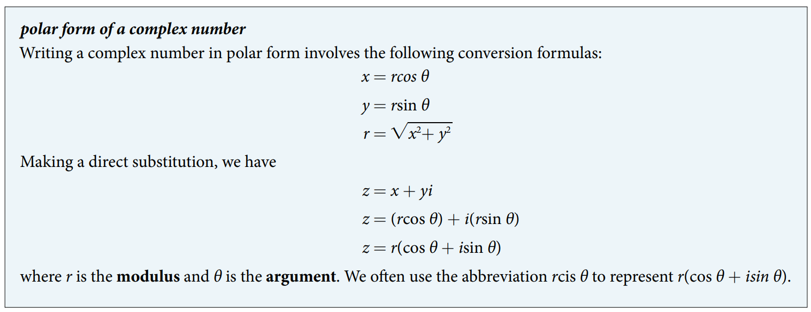

### 10.5 Polar Form of Complex Numbers

- 🎯 `jupyter-lab` practice

```
# Example 1

%matplotlib widget
import matplotlib.pyplot as plt
import numpy as np

%matplotlib widget
import matplotlib.pyplot as plt
import numpy as np

x = 2
y = -3

fig, ax = plt.subplots()
ax.scatter(x, y, color='k')

ax.set_aspect('equal', 'box')
plt.grid(which='major', color='#666666', linestyle='-')
plt.minorticks_on()
plt.grid(which='minor', color='#999999', linestyle='-', alpha=0.2)
plt.xlim(-6, 6)
plt.ylim(-6, 6)
plt.xlabel('Real')
plt.ylabel('Imaginary')
```


- 🎯 `jupyter-lab` practice

```
# Example 2

from sympy import symbols, sqrt, Abs

x, y, z = symbols('x, y, z')
i = sqrt(-1)

x = sqrt(5)
y = -1
z = x + y*i
z

Abs(z)
```

- The polar form of a complex number





- 🎯 `jupyter-lab` practice

```
# proof

from sympy import symbols, sqrt, cos, sin, trigsimp

i = sqrt(-1)
z1, z2 = symbols('z1, z2')
r1, r2 = symbols('r1, r2')
theta1, theta2 = symbols('theta1, theta2')

z1 = r1*(cos(theta1) + i*sin(theta1))
z1

z2 = r2*(cos(theta2) + i*sin(theta2))
z2

z1*z2

trigsimp(z1*z2)
```

- 🎯 `jupyter-lab` practice

```
# Example 8 (plot)

%matplotlib widget
import matplotlib.pyplot as plt
import numpy as np

theta_list = np.array([80, 145])*np.pi/180
r_list = np.array([4, 2])

for i in range(0, len(theta_list)):
    r = r_list[i]
    theta = theta_list[i]
    if r < 0:
        r_list[i] *= -1
        if theta >= 0:
            theta_list[i] += np.pi
        else:
            theta_list[i] -= np.pi
                
fig, ax = plt.subplots(subplot_kw={'projection': 'polar'})
ax.scatter(theta_list, r_list)
ax.scatter((80 + 145)*np.pi/180, 4*2, color='r')
ax.set_rmin(0)
ax.set_rmax(9)
ax.set_rticks(range(0, 10))
ax.set_rlabel_position(-22.5)
ax.grid(True)
```


- 🎯 `jupyter-lab` practice

```
# proof

from sympy import symbols, sqrt, cos, sin, trigsimp, conjugate

i = sqrt(-1)
z1, z2 = symbols('z1, z2')
r1, r2 = symbols('r1, r2', real=True)
theta1, theta2 = symbols('theta1, theta2', real=True)
cis1 = cos(theta1) + i*sin(theta1)
cis2 = cos(theta2) + i*sin(theta2)

z1 = r1*(cis1)
z2 = r2*(cis2)

z1/z2

num = z1*conjugate(cis2)
num = trigsimp(num)
num

den = z2*conjugate(cis2)
den = trigsimp(den)
den

num/den
```

- 🎯 `jupyter-lab` practice

```
# Example 9 (plot)

%matplotlib widget
import matplotlib.pyplot as plt
import numpy as np

theta_list = np.array([213, 33])*np.pi/180
r_list = np.array([2, 4])

for i in range(0, len(theta_list)):
    r = r_list[i]
    theta = theta_list[i]
    if r < 0:
        r_list[i] *= -1
        if theta >= 0:
            theta_list[i] += np.pi
        else:
            theta_list[i] -= np.pi
                
fig, ax = plt.subplots(subplot_kw={'projection': 'polar'})
#ax.plot(theta_list, r_list)
ax.scatter(theta_list, r_list)
ax.scatter((213 - 33)*np.pi/180, 2/4, color='r')
ax.set_rmin(0)
ax.set_rmax(5)
ax.set_rticks(range(0, 6))
ax.set_rlabel_position(-22.5)
ax.grid(True)
```


> proof - Homework

- 🎯 `jupyter-lab` practice

```
# Example 10

from sympy import symbols, sqrt, pi, cos, sin, atan, S, simplify

i = sqrt(-1)

r, theta, n = symbols('r, theta, n')

zn = r**n * ( cos(n*theta) + i*sin(n*theta) )
zn

x = S(1) # symbolic integer
y = 1
atan(y/x) # y/x symbolic integer division

zn = zn.subs({r: sqrt(x**2 + y**2), theta: atan(y/x), n: 5})
zn

simplify(zn)
```

- 🎯 `jupyter-lab` practice

```
# Example 10 (plot)


```


> proof - Homework

- Youtube 
    - [DeMoivres Theorem - Powers and nth Roots of Complex Numbers](https://youtu.be/Xnyq3UzNS7U)
    
- 🎯 `jupyter-lab` practice

```
# Example 11

from sympy import symbols, sqrt, pi, cos, sin

i = sqrt(-1)

r, theta, n, k = symbols('r, theta, n, k')

z = r*(cos(theta) + i*sin(theta))
z

z_nth = r**(1/n) * (cos(theta/n + 2*pi*k/n) + i*sin(theta/n + 2*pi*k/n))
z_nth

z = z.subs({r: 8, theta: 2*pi/3})
z

z_nth_0 = z_nth.subs({r: 8, theta: 2*pi/3, n: 3, k: 0})
z_nth_0

z_nth_1 = z_nth.subs({r: 8, theta: 2*pi/3, n: 3, k: 1})
z_nth_1

z_nth_2 = z_nth.subs({r: 8, theta: 2*pi/3, n: 3, k: 2})
z_nth_2

z.evalf()

z_nth_0.evalf()

z_nth_1.evalf()

z_nth_2.evalf()

(z_nth_0**3).evalf()

(z_nth_1**3).evalf()

(z_nth_2**3).evalf()
```

- 🎯 `jupyter-lab` practice

```
# Example 11 (plot)

``