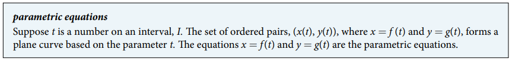

### 10.6 Parametric Equations




- 🎯 `jupyter-lab` practice

```
# Example 1 (interactive)

%matplotlib widget
import ipywidgets as widgets
from IPython.display import display
import matplotlib.pyplot as plt
import numpy as np

fig, ax = plt.subplots()
@widgets.interact(t=(-4, 4, 0.1))
def f(t=-4):
    x = t
    y = x**2 - 1
    ax.scatter(x, y, s=10)
    ax.set_aspect('equal', 'box')
    plt.grid(which='major', color='#666666', linestyle='-')
    plt.minorticks_on()
    plt.grid(which='minor', color='#999999', linestyle='-', alpha=0.2)
    plt.xlim(-6, 6)
    plt.ylim(-2, 17)
```


- 🎯 `jupyter-lab` practice

```
# Example 1

%matplotlib widget
import matplotlib.pyplot as plt
import numpy as np

t = np.arange(-4, 4, 0.01)
x = t
y = x**2 - 1

fig, ax = plt.subplots()
ax.plot(x, y)
ax.set_aspect('equal', 'box')
plt.grid(which='major', color='#666666', linestyle='-')
plt.minorticks_on()
plt.grid(which='minor', color='#999999', linestyle='-', alpha=0.2)
plt.xlim(-6, 6)
plt.ylim(-2, 17)
```


- 🎯 `jupyter-lab` practice

```
# Example 3 (interactive)

```