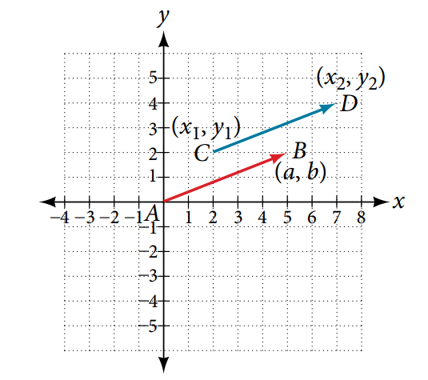
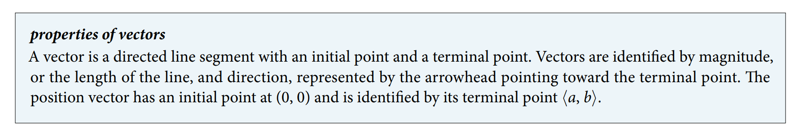

### 10.8 Vectors




- 🎯 `jupyter-lab` practice

``` 
# Example 3

%matplotlib widget
import ipywidgets as widgets
from IPython.display import display
import matplotlib.pyplot as plt
import numpy as np

P = (2, 3)
Q = (6, 4)
v = (Q[0] - P[0], Q[1] - P[1])

fig, ax = plt.subplots()
ax.quiver(P[0], P[1], v[0], v[1], color='b', units='xy', scale=1)
ax.quiver(0, 0, v[0], v[1], color='r', units='xy', scale=1)
ax.set_aspect('equal', 'box')

plt.grid(which='major', color='#666666', linestyle='-')
plt.minorticks_on()
plt.grid(which='minor', color='#999999', linestyle='-', alpha=0.2)  
plt.xlim(-4, 8)
plt.ylim(-6, 6)
```