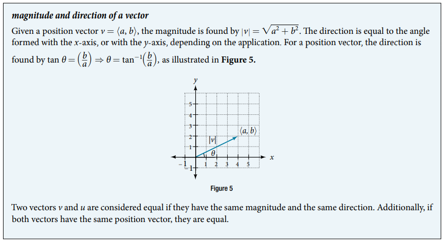
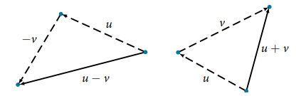
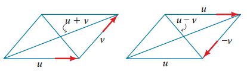
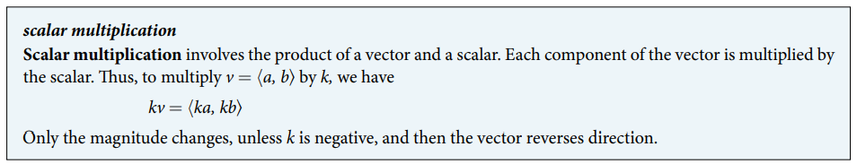
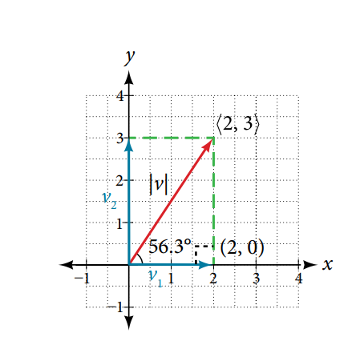
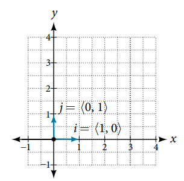
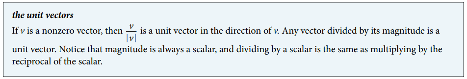
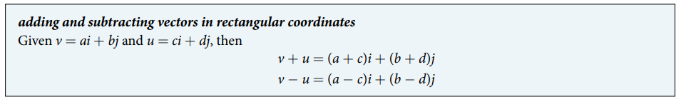
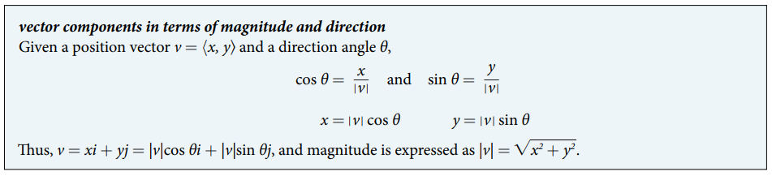
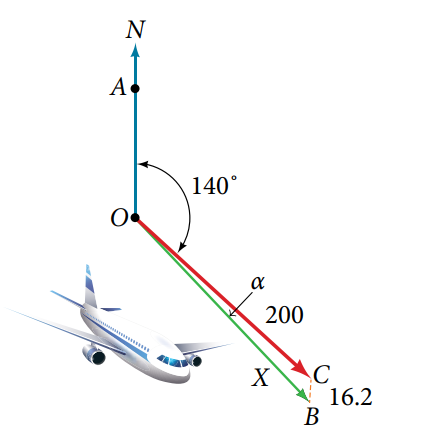

### 10.8 Vectors


- 🎯 `jupyter-lab` practice

``` 
# Example 1

%matplotlib widget
import matplotlib.pyplot as plt
import numpy as np

P = np.array([2, 3])
Q = np.array([6, 4])
v = np.array([Q[0] - P[0], Q[1] - P[1]])

fig, ax = plt.subplots()
ax.quiver(P[0], P[1], v[0], v[1], color='b', units='xy', scale=1)
ax.quiver(0, 0, v[0], v[1], color='r', units='xy', scale=1)
ax.set_aspect('equal', 'box')

plt.grid(which='major', color='#666666', linestyle='-')
plt.minorticks_on()
plt.grid(which='minor', color='#999999', linestyle='-', alpha=0.2)  
plt.xlim(-4, 8)
plt.ylim(-6, 6)
```





- 🎯 `jupyter-lab` practice

``` 
# Example 3

%matplotlib widget
import matplotlib.pyplot as plt
import numpy as np

P = np.array([-8, 1])
Q = np.array([-2, -5])
u = np.array([Q[0] - P[0], Q[1] - P[1]])
u_mag = np.sqrt(u[0]**2 + u[1]**2)
u_arg = np.arctan(u[1]/u[0])*180/np.pi
print(f"magnitude of u: {u_mag}")
print(f"direction of u: {u_arg} in degree")

fig, ax = plt.subplots()
ax.quiver(0, 0, u[0], u[1], color='C0', units='xy', scale=1)
ax.set_aspect('equal', 'box')

plt.grid(which='major', color='#666666', linestyle='-')
plt.minorticks_on()
plt.grid(which='minor', color='#999999', linestyle='-', alpha=0.2)  
plt.xlim(-6, 6)
plt.ylim(-6, 6)
```

- 🎯 `jupyter-lab` practice

``` 
# Example 4

%matplotlib widget
import matplotlib.pyplot as plt
import numpy as np

v_init = np.array([5, -3])
v_term = np.array([-1, 2])
v_diff = np.array([v_term[0] - v_init[0], v_term[1] - v_init[1]])
v_posi = np.array([v_diff[0], v_diff[1]])
v_posi_mag = np.sqrt(v_posi[0]**2 + v_posi[1]**2)
v_posi_arg = np.arctan(v_posi[1]/v_posi[0])*180/np.pi
print(f"magnitude of v's position vector: {v_posi_mag}")
print(f"direction of v's position vector: {v_posi_arg} in degree")

u_init = np.array([-1, -3])
u_term = np.array([-7, 2])
u_diff = np.array([u_term[0] - u_init[0], u_term[1] - u_init[1]])
u_posi = np.array([u_diff[0], u_diff[1]])
u_posi_mag = np.sqrt(u_posi[0]**2 + u_posi[1]**2)
u_posi_arg = np.arctan(u_posi[1]/u_posi[0])*180/np.pi
print(f"magnitude of u's position vector: {u_posi_mag}")
print(f"direction of u's position vector: {u_posi_arg} in degree")

fig, ax = plt.subplots()
ax.quiver(v_init[0], v_init[1], v_diff[0], v_diff[1], color='g', units='xy', scale=1)
ax.quiver(u_init[0], u_init[1], u_diff[0], u_diff[1], color='r', units='xy', scale=1)
ax.quiver(0, 0, v_posi[0], v_posi[1], color='C0', units='xy', scale=1)
ax.set_aspect('equal', 'box')

plt.grid(which='major', color='#666666', linestyle='-')
plt.minorticks_on()
plt.grid(which='minor', color='#999999', linestyle='-', alpha=0.2)  
plt.xlim(-7, 7)
plt.ylim(-6, 6)
```






- 🎯 `jupyter-lab` practice

``` 
# Example 5

from sympy.vector import CoordSys3D

N = CoordSys3D('N')


u = 3*N.i -2*N.j
u

v = (-1)*N.i + 4*N.j
v

u + v

u - v
```


- 🎯 `jupyter-lab` practice

``` 
# Example 5: vector addition (parallelogram method)

%matplotlib widget
import matplotlib.pyplot as plt
import numpy as np

u_init = np.array([0, 0])
u_term = np.array([3, -2])
u = np.subtract(u_term, u_init)
print(u)

v_init = np.array([0, 0])
v_term = np.array([-1, 4])
v = np.subtract(v_term, v_init)
print(v)

u_plus_v = np.add(u, v)
print(u_plus_v)

fig, ax = plt.subplots()
ax.quiver(0, 0, u[0], u[1], color='C0', units='xy', scale=1)
ax.quiver(0, 0, v[0], v[1], color='C0', units='xy', scale=1)
ax.quiver(0, 0, u_plus_v[0], u_plus_v[1], color='r', units='xy', scale=1)
ax.set_aspect('equal', 'box')

plt.grid(which='major', color='#666666', linestyle='-')
plt.minorticks_on()
plt.grid(which='minor', color='#999999', linestyle='-', alpha=0.2)  
plt.xlim(-6, 6)
plt.ylim(-6, 6)
```


- 🎯 `jupyter-lab` practice

``` 
# Example 5: vector addition (head-to-tail method)

%matplotlib widget
import matplotlib.pyplot as plt
import numpy as np

u_init = np.array([0, 0])
u_term = np.array([3, -2])
u = np.subtract(u_term, u_init)
print(u)

v_init = np.array([3, -2])
v_diff = np.array([-1, 4])
v_term = v_init + v_diff 
v = np.subtract(v_term, v_init)
print(v)

u_plus_v = np.add(u, v)
print(u_plus_v)

fig, ax = plt.subplots()
ax.quiver(0, 0, u[0], u[1], color='C0', units='xy', scale=1)
ax.quiver(v_init[0], v_init[1], v_diff[0], v_diff[1], color='C0', units='xy', scale=1)
ax.quiver(0, 0, u_plus_v[0], u_plus_v[1], color='r', units='xy', scale=1)
ax.set_aspect('equal', 'box')

plt.grid(which='major', color='#666666', linestyle='-')
plt.minorticks_on()
plt.grid(which='minor', color='#999999', linestyle='-', alpha=0.2)  
plt.xlim(-6, 6)
plt.ylim(-6, 6)
```

- 🎯 `jupyter-lab` practice

``` 
# Example 5: vector subtraction (parallelogram method)

%matplotlib widget
import matplotlib.pyplot as plt
import numpy as np

u_init = np.array([0, 0])
u_term = np.array([3, -2])
u = np.subtract(u_term, u_init)
print(u)

v_init = np.array([0, 0])
v_term = np.array([-1, 4])
v = np.subtract(v_term, v_init)
print(v)

u_minus_v = np.subtract(u, v)
print(u_minus_v)

fig, ax = plt.subplots()
ax.quiver(0, 0, u[0], u[1], color='C0', units='xy', scale=1)
ax.quiver(0, 0, v[0], v[1], color='C0', units='xy', scale=1)
ax.quiver(0, 0, -v[0], -v[1], color='C0', units='xy', scale=1)
ax.quiver(0, 0, u_minus_v[0], u_minus_v[1], color='r', units='xy', scale=1)
ax.set_aspect('equal', 'box')

plt.grid(which='major', color='#666666', linestyle='-')
plt.minorticks_on()
plt.grid(which='minor', color='#999999', linestyle='-', alpha=0.2)  
plt.xlim(-6, 6)
plt.ylim(-7, 7)
```


- 🎯 `jupyter-lab` practice

``` 
# Example 5: vector subtraction (head-to-tail method)

%matplotlib widget
import matplotlib.pyplot as plt
import numpy as np

u_init = np.array([0, 0])
u_term = np.array([3, -2])
u = np.subtract(u_term, u_init)
print(u)

v_init = np.array([3, -2])
v_diff = np.array([-1, 4])
v_term = v_init + v_diff 
v = np.subtract(v_term, v_init)
print(v)

u_minus_v = np.subtract(u, v)
print(u_minus_v)

fig, ax = plt.subplots()
ax.quiver(0, 0, u[0], u[1], color='C0', units='xy', scale=1)
ax.quiver(v_init[0], v_init[1], -v_diff[0], -v_diff[1], color='C0', units='xy', scale=1)
ax.quiver(0, 0, u_minus_v[0], u_minus_v[1], color='g', units='xy', scale=1)
ax.set_aspect('equal', 'box')

plt.grid(which='major', color='#666666', linestyle='-')
plt.minorticks_on()
plt.grid(which='minor', color='#999999', linestyle='-', alpha=0.2)  
plt.xlim(-6, 6)
plt.ylim(-6, 6)
```




- 🎯 `jupyter-lab` practice

``` 
# Example 6

from sympy import Rational
from sympy.vector import CoordSys3D

N = CoordSys3D('N')


v = 3*N.i + 1*N.j
v

3*v

Rational(1, 2)*v

-v
```


- 🎯 `jupyter-lab` practice

``` 
# Example 7

from sympy.vector import CoordSys3D

N = CoordSys3D('N')

u = 3*N.i - 2*N.j
u

v = (-1)*N.i + 4*N.j
v

w = 3*u + 2*v
w
```

- Finding component form



- 🎯 `jupyter-lab` practice

``` 
# Example 8

from sympy.vector import CoordSys3D

N = CoordSys3D('N')

v = (7 - 3)*N.i + (4 - 2)*N.j
v

v.components
```


- The unit vectors




- 🎯 `jupyter-lab` practice

``` 
# Example 9

from sympy.vector import CoordSys3D

N = CoordSys3D('N')

v = (-5)*N.i + (12)*N.j
v

v.magnitude()

v_unit = v.normalize()
v_unit

v_unit.magnitude()
```


- 🎯 `jupyter-lab` practice

``` 
# Figure 15

%matplotlib widget
import matplotlib.pyplot as plt
import numpy as np

v = np.array([-5, 12])
v_mag = np.sqrt(np.sum(v**2)) 
print(f"|v| = {v_mag}")                
v_unit = v/v_mag

fig, ax = plt.subplots()
ax.quiver(0, 0, v[0], v[1], color='C0', units='xy', scale=1)
ax.quiver(0, 0, v_unit[0], v_unit[1], color='orange', units='xy', scale=1)
ax.set_aspect('equal', 'box')

plt.grid(which='major', color='#666666', linestyle='-')
plt.minorticks_on()
plt.grid(which='minor', color='#999999', linestyle='-', alpha=0.2)  
plt.xlim(-8, 2)
plt.ylim(-1, 14)
```




- 🎯 `jupyter-lab` practice

``` 
# Example 12

from sympy.vector import CoordSys3D

N = CoordSys3D('N')

v1 = 2*N.i - 3*N.j
v1

v2 = 4*N.i + 5*N.j
v2

v1 + v2
```




- 🎯 `jupyter-lab` practice

``` 
# Example 13

from sympy import pi, cos, sin
from sympy.vector import CoordSys3D

N = CoordSys3D('N')

v_mag = 7

x = v_mag * cos(theta)
x

y = v_mag * sin(theta)
y

v = x*N.i + y*N.j
v
```


- 🎯 `jupyter-lab` practice

``` 
# Example 15

from sympy import acos
from sympy.vector import CoordSys3D

N = CoordSys3D('N')

v1 = 5*N.i + 2*N.j
v1

v2 = 3*N.i + 7*N.j
v2

v1.dot(v2)

v1_unit = v1/v1.magnitude()
v1_unit

v2_unit = v2/v2.magnitude()
v2_unit

cos_theta = v1_unit.dot(v2_unit)
cos_theta

acos(cos_theta)*180/pi # in degree
```




- 🎯 `jupyter-lab` practice

``` 
# Example 17 (vector approach)

from sympy import pi, cos, sin
from sympy.vector import CoordSys3D

N = CoordSys3D('N')

OC_mag = 200
OC_theta = -50*pi/180
OC_x = OC_mag*cos(OC_theta)
OC_y = OC_mag*sin(OC_theta)
OC = OC_x*N.i + OC_y*N.j
OC

CB_mag = 16.2
CB_theta = -90*pi/180
CB_x = CB_mag*cos(CB_theta)
CB_y = CB_mag*sin(CB_theta)
CB = CB_x*N.i + CB_y*N.j
CB

OB = OC + CB
OB

ground_speed = OB.magnitude()
ground_speed.evalf()

OC_unit = OC.normalize()
OB_unit = OB.normalize()
cos_theta = OC_unit.dot(OB_unit)
alpha = acos(cos_theta)*180/pi # in degree
alpha.evalf()
```
