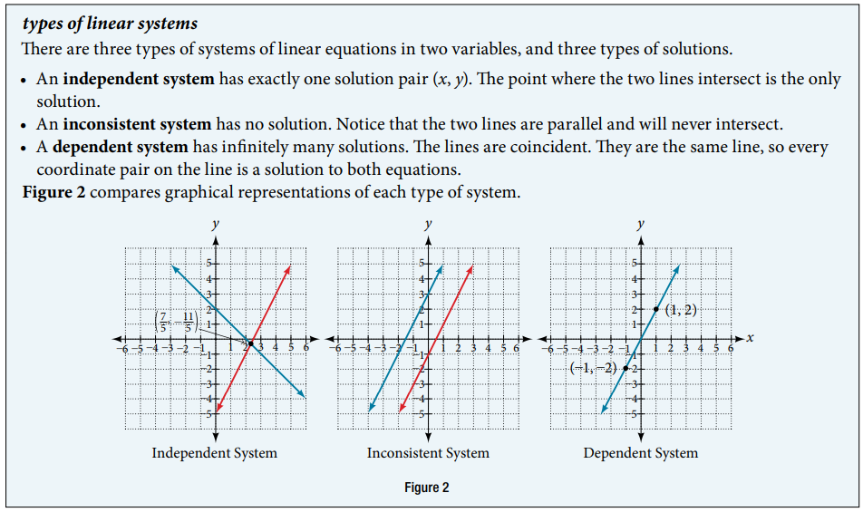

### 11.1 Systems of Linear Equations: Two Variables




- 🎯 `jupyter-lab` practice

``` 
# Example 3

from sympy import symbols, Eq, linsolve

x, y = symbols('x, y')

eq1 = Eq(-x + y, -5)
eq2 = Eq(2*x - 5*y, 1)

linsolve([eq1, eq2], (x, y))
```


- 🎯 `jupyter-lab` practice

``` 
# Example 8

from sympy import symbols, Eq, linsolve

x, y = symbols('x, y')

eq1 = Eq(x, 9 - 2*y)
eq2 = Eq(x + 2*y, 13)

linsolve([eq1, eq2], (x, y))
```

- 🎯 `jupyter-lab` practice

``` 
# Example 9

from sympy import symbols, Eq, linsolve

x, y = symbols('x, y')

eq1 = Eq(x + 3*y, 2)
eq2 = Eq(3*x + 9*y, 6)

linsolve([eq1, eq2], (x, y))
```