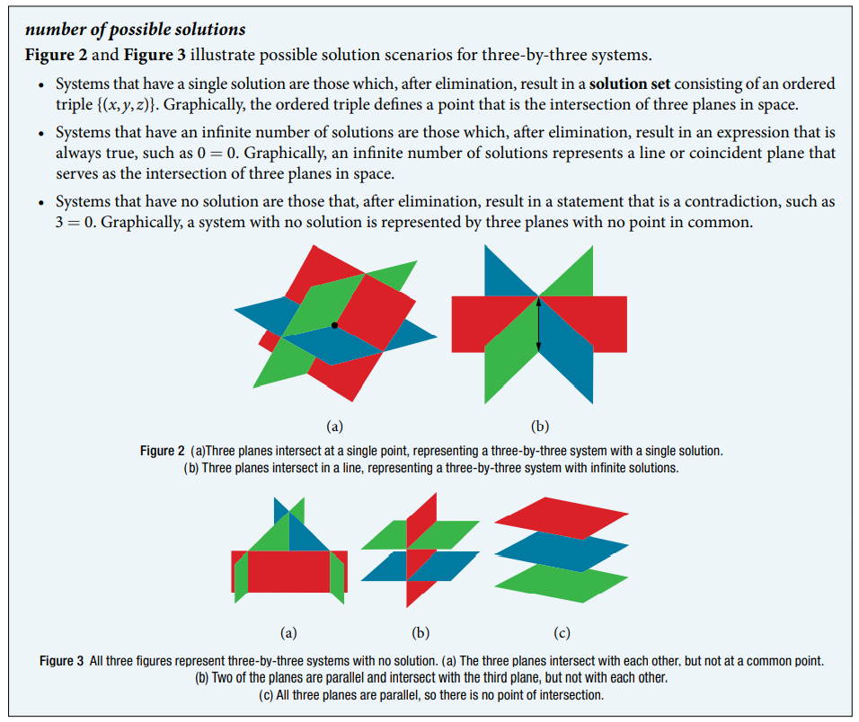

### 11.2 Systems of Linear Equations: Three Variables




- 🎯 `jupyter-lab` practice

``` 
# Example 1

from sympy import symbols, Eq, linsolve

x, y, z = symbols('x, y, z') 

eq1 = Eq(x + y + z, 2)
eq2 = Eq(6*x - 4*y + 5*z, 31)
eq3 = Eq(5*x + 2*y + 2*z, 13)

linsolve([eq1, eq2, eq3], (x, y, z))
```


- 🎯 `jupyter-lab` practice

``` 
# Example 2

from sympy import symbols, Eq, linsolve

x, y, z = symbols('x, y, z') 

eq1 = Eq(x - 2*y + 3*z, 9)
eq2 = Eq(-x + 3*y - z, -6)
eq3 = Eq(2*x - 5*y + 5*z, 17)

linsolve([eq1, eq2, eq3], (x, y, z))

linsolve([eq1, eq2], (x, y))

linsolve([eq2, eq3], (x, y))

linsolve([eq3, eq1], (x, y))
```


- 🎯 `jupyter-lab` practice

``` 
# Figure 4

%matplotlib widget
import matplotlib.pyplot as plt
import numpy as np
from mpl_toolkits import mplot3d

def eq1(x, y):
    return (-x + 2*y + 9)/3

def eq2(x, y):
    return (-x + 3*y + 6)

def eq3(x, y):
    return (-2*x + 5*y + 17)/5


x = np.arange(-6, 6, 0.1)
y = np.arange(-6, 6, 0.1)
z1 = np.arange(9/7, 3, 0.1)
z2 = np.arange(15/10, 27/10, 0.1)
z3 = np.arange(1, 17/5, 0.1)

X, Y = np.meshgrid(x, y)
Z1 = eq1(X, Y)
Z2 = eq2(X, Y)
Z3 = eq3(X, Y)

fig = plt.figure()
ax = plt.axes(projection='3d')

ax.plot_surface(X, Y, Z1, color='r', shade=False, alpha=0.25)
ax.plot_surface(X, Y, Z2, color='g', shade=False, alpha=0.25)
ax.plot_surface(X, Y, Z3, color='b', shade=False, alpha=0.25)

ax.plot3D(15 - 7*𝑧1, 3 - 2*𝑧1, z1, 'r')
ax.plot3D(21 - 10*z2, 5 - 3*z2, z2, 'g')
ax.plot3D(11 - 5*z3, 1 - z3, z3, 'b')

ax.scatter3D(1, -1, 2, color='k')

ax.set_xlabel('x')
ax.set_ylabel('y')
ax.set_zlabel('z')
```


- 🎯 `jupyter-lab` practice

``` 
# Example 4

from sympy import symbols, Eq, linsolve

x, y, z = symbols('x, y, z') 

eq1 = Eq(x - 3*y + z, 4)
eq2 = Eq(-x + 2*y - 5*z, 3)
eq3 = Eq(5*x - 13*y + 13*z, 8)

linsolve([eq1, eq2, eq3], (x, y, z))

linsolve([eq1, eq2], (x, y))

linsolve([eq2, eq3], (x, y))

linsolve([eq3, eq1], (x, y))
```


- 🎯 `jupyter-lab` practice

``` 
# Example 4 (plot)

%matplotlib widget
import matplotlib.pyplot as plt
import numpy as np
from mpl_toolkits import mplot3d

def eq1(x, y):
    return (-x + 3*y + 4)

def eq2(x, y):
    return (-x + 2*y -3)/5

def eq3(x, y):
    return (-5*x -13*y + 8)/13


x = np.arange(-6, 6, 0.1)
y = np.arange(-6, 6, 0.1)
z1 = np.arange(-23/13, -11/13, 0.1)
z2 = np.arange(-73/39, -37/39, 0.1)
z3 = np.arange(-20/13, -8/13, 0.1)

X, Y = np.meshgrid(x, y)
Z1 = eq1(X, Y)
Z2 = eq2(X, Y)
Z3 = eq3(X, Y)

fig = plt.figure()
ax = plt.axes(projection='3d')
ax.plot_surface(X, Y, Z1, color='r', shade=False, alpha=0.25)
ax.plot_surface(X, Y, Z2, color='g', shade=False, alpha=0.25)
ax.plot_surface(X, Y, Z3, color='b', shade=False, alpha=0.25)

ax.plot3D(-13*z1 - 17, -4*𝑧1 - 7, z1, 'r')
ax.plot3D(-13*z2 - 55/3, -4*z2 - 23/3, z2, 'g')
ax.plot3D(-13*z3 - 14, -4*z3 - 6, z3, 'b')

ax.set_xlabel('x')
ax.set_ylabel('y')
ax.set_zlabel('z')
```


- 🎯 `jupyter-lab` practice

``` 
# Example 5

from sympy import symbols, Eq, linsolve

x, y, z = symbols('x, y, z') 

eq1 = Eq(x - 3*y + z, 4)
eq2 = Eq(-x + 2*y - 5*z, 3)
eq3 = Eq(5*x - 13*y + 13*z, 8)

linsolve([eq1, eq2, eq3], (x, y, z))

linsolve([eq1, eq2], (x, y))

linsolve([eq2, eq3], (x, y))

linsolve([eq3, eq1], (x, y))
```