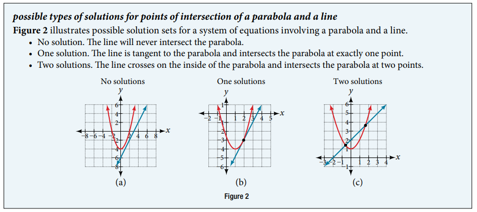
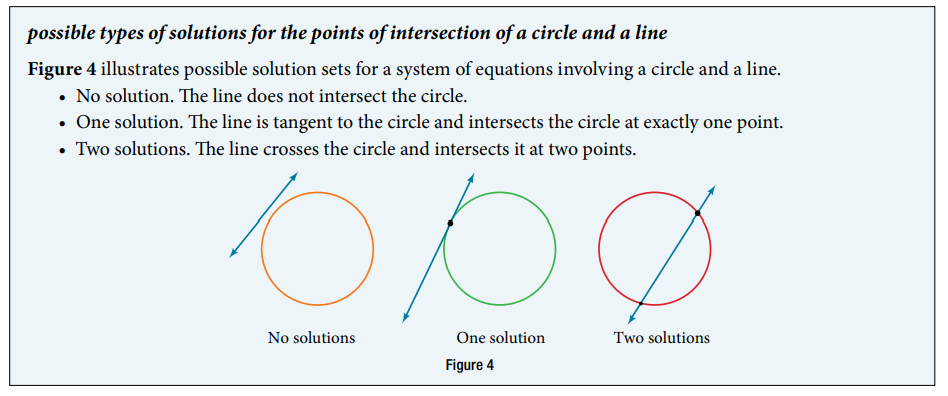
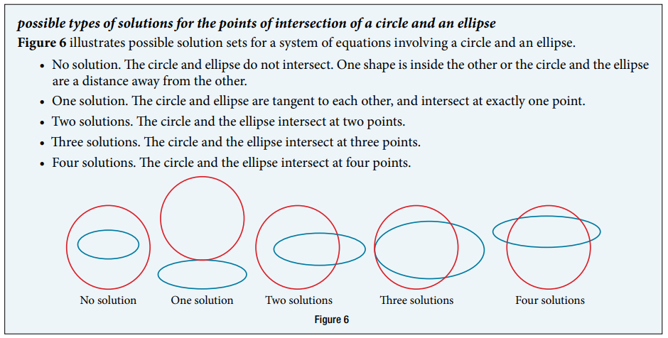
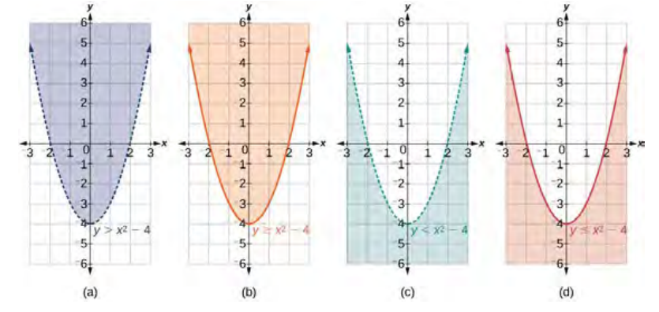

### 11.3 Systems of Nonlinear Equations and Inequalities: Two Variables





- 🎯 `jupyter-lab` practice

``` 
# Example 1

from sympy import symbols, Eq, nonlinsolve

x, y, z = symbols('x, y, z') 

eq1 = Eq(x - y, -1)
eq2 = Eq(y, x**2 + 1)

nonlinsolve([eq1, eq2], (x, y))
```


- 🎯 `jupyter-lab` practice

``` 
# Figure 3

%matplotlib widget
import matplotlib.pyplot as plt
import numpy as np

x = np.arange(-6, 6, 0.01)
y1 = x + 1
y2 = x**2 + 1

fig, ax = plt.subplots()
ax.plot(x, y1)
ax.plot(x, y2, 'r')
ax.scatter(0, 1, color='k')
ax.scatter(1, 2, color='k')
ax.grid()
ax.set_xlim(-6, 6)
ax.set_ylim(-6, 6)
```




- 🎯 `jupyter-lab` practice

``` 
# Example 2

from sympy import symbols, Eq, nonlinsolve

x, y, z = symbols('x, y, z') 

eq1 = Eq(x**2 + y**2, 5)
eq2 = Eq(y, 3*x - 5)

nonlinsolve([eq1, eq2], (x, y))
```


- 🎯 `jupyter-lab` practice

``` 
# Figure 5

%matplotlib widget
import matplotlib.pyplot as plt
import numpy as np

xc = np.arange(-np.sqrt(5) + 0.0001, np.sqrt(5), 0.001)
yc1 = np.sqrt(5 - xc**2)
yc2 = -np.sqrt(5 - xc**2)

x = np.arange(-6, 6, 0.01)
y = 3*x - 5

fig, ax = plt.subplots()
ax.plot(xc, yc1, 'r')
ax.plot(xc, yc2, 'r')
ax.plot(x, y, 'C0')
ax.scatter(1, -2, color='k')
ax.scatter(2, 1, color='k')
ax.grid()
ax.set_aspect('equal', 'box')
ax.set_xlim(-6, 6)
ax.set_ylim(-6, 6)
```





- 🎯 `jupyter-lab` practice

``` 
# Example 3

from sympy import symbols, Eq, nonlinsolve

x, y, z = symbols('x, y, z') 

eq1 = Eq(x**2 + y**2, 26)
eq2 = Eq(3*x**2 + 25*y**2, 100)

nonlinsolve([eq1, eq2], (x, y))
```


- 🎯 `jupyter-lab` practice

``` 
# Figure 5

%matplotlib widget
import matplotlib.pyplot as plt
import numpy as np

xc = np.arange(-np.sqrt(26) + 0.0001, np.sqrt(26), 0.001)
yc1 = np.sqrt(26 - xc**2)
yc2 = -np.sqrt(26 - xc**2)

xe = np.arange(-np.sqrt(100/3) + 0.0001, np.sqrt(100/3), 0.001)
ye1 = np.sqrt((100 - 3*xe**2)/25)
ye2 = -np.sqrt((100 - 3*xe**2)/25)

fig, ax = plt.subplots()

ax.plot(xc, yc1, 'C0')
ax.plot(xc, yc2, 'C0')
ax.plot(xe, ye1, 'r')
ax.plot(xe, ye2, 'r')

ax.scatter(-5, -1, color='k')
ax.scatter(-5, 1, color='k')
ax.scatter(5, -1, color='k')
ax.scatter(5, 1, color='k')

ax.grid()
ax.set_aspect('equal', 'box')
ax.set_xlim(-6, 6)
ax.set_ylim(-6, 6)
```





- 🎯 `jupyter-lab` practice

``` 
# Example 4

%matplotlib widget
import matplotlib.pyplot as plt
import numpy as np

x = np.arange(-6, 6, 0.01)
y = np.arange(-1, 6, 0.01)
X, Y = np.meshgrid(x, y)

y1 = x**2 + 1

fig, ax = plt.subplots()
ax.plot(x, y1, '--')
ax.imshow( (Y > X**2 + 1).astype(int), \
          origin="lower", extent=[-6, 6, -1, 6], cmap="Greys", alpha = 0.25)
ax.scatter(0, 2, color='k')
ax.scatter(2, 0, color='k')
ax.grid()
ax.set_aspect('equal', 'box')
ax.set_xlim(-6, 6)
ax.set_ylim(-1, 6)
```


- 🎯 `jupyter-lab` practice

``` 
# Example 5

%matplotlib widget
import matplotlib.pyplot as plt
import numpy as np

x = np.arange(-12, 12, 0.01)
y = np.arange(-2, 14, 0.01)
X, Y = np.meshgrid(x, y)

y1 = x**2
y2 = -2*x**2 + 12

fig, ax = plt.subplots()
ax.plot(x, y1, 'r')
ax.plot(x, y2)
ax.imshow( (Y >= X**2).astype(int), \
          origin="lower", extent=[-12, 12, -2, 14], cmap="Reds", alpha = 0.25)
ax.imshow( (Y <= -2*X**2 + 12).astype(int), \
          origin="lower", extent=[-12, 12, -2, 14], cmap="Blues", alpha = 0.25)
ax.scatter(-2, 4, color='k')
ax.scatter(2, 4, color='k')
ax.grid()
ax.set_aspect('equal', 'box')
ax.set_xlim(-12, 12)
ax.set_ylim(-2, 14)
```


