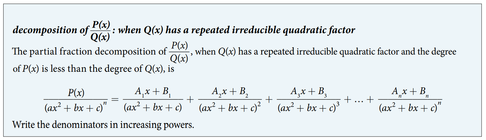

### 11.4 Partial Fractions


- 🎯 `jupyter-lab` practice

``` 
# Example 1

from sympy import symbols, apart, together

x = symbols('x')

expr = 3*x / ( (x + 2)*(x - 1) )
expr

partial_fraction = apart(expr)
partial_fraction

together(partial_fraction)
```


- 🎯 `jupyter-lab` practice

``` 
# Example 2

from sympy import symbols, apart

x = symbols('x')

expr = (-x**2 + 2*x + 4) / ( x**3 - 4*x**2 + 4*x )
expr

partial_fraction = apart(expr)
partial_fraction
```


- 🎯 `jupyter-lab` practice

``` 
# Example 3

from sympy import symbols, apart

x = symbols('x')

expr = (8*x**2 - 12*x - 20) / ( (x + 3)*(x**2 + x + 2) )
expr

partial_fraction = apart(expr)
partial_fraction
```




- 🎯 `jupyter-lab` practice

``` 
# Example 4

from sympy import symbols, apart

x = symbols('x')

expr = (x**4 + x**3 + x**2 - x + 1) / ( x*(x**2 + 1)**2 )
expr

partial_fraction = apart(expr)
partial_fraction
```