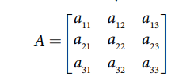
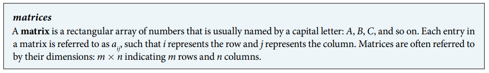
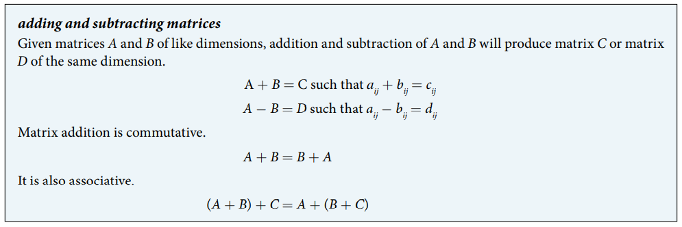
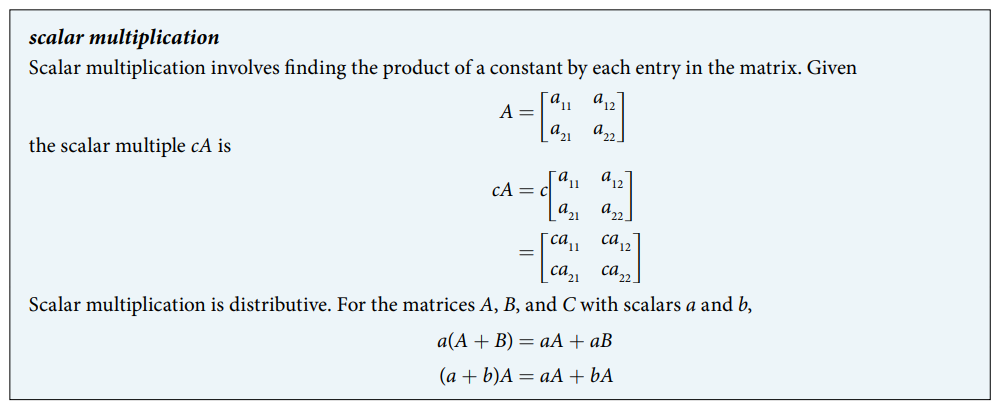
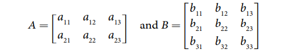
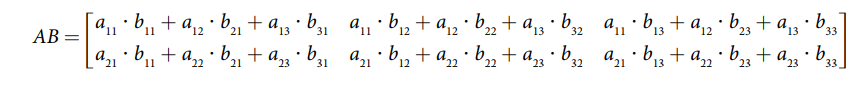
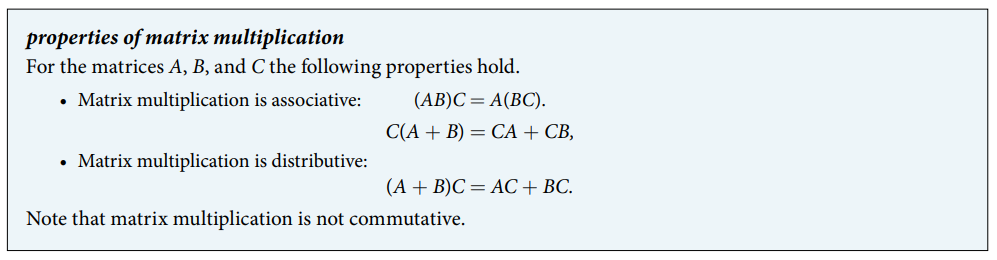

### 11.5 Matrices and Matrix Operations

- The $m \times n$ matrix





- 🎯 `jupyter-lab` practice

``` 
# Example 1

from sympy.matrices import Matrix

A = Matrix( [ [2, 1, 0], [2, 4, 7], [3, 1, -2] ] )
A

A.shape

A[2, 0]  # sympy counts 0, 1, 2, ... (math counts 1, 2, 3)

A[1, 1]
```





- 🎯 `jupyter-lab` practice

``` 
# Example 2

from sympy import symbols
from sympy.matrices import Matrix

a, b, c, d, e, f, g, h = symbols('a, b, c, d, e, f, g, h')

A = Matrix( [ [a, b], [c, d] ] )
A

B = Matrix( [ [e, f], [g, h] ] )
B

A + B

A - B
```


- 🎯 `jupyter-lab` practice

``` 
# Example 5

from sympy.matrices import Matrix

A = Matrix( [ [2, -10, -2], [14, 12, 10], [4, -2, 2] ] )
A

B = Matrix( [ [6, 10, -2], [0, -12, -4], [-5, 2, -2] ] )
B

A + B

A - B
```





- 🎯 `jupyter-lab` practice

``` 
# Example 6

from sympy.matrices import Matrix

A = Matrix( [ [8, 1], [5, 4] ] )
A

3*A
```


- 🎯 `jupyter-lab` practice

``` 
# Example 7

from sympy.matrices import Matrix

A = Matrix( [ [1, -2, 0], [0, -1, 2], [4, 3, -6] ] )
A

B = Matrix( [ [-1, 2, 1], [0, -3, 2], [0, 1, -4] ] )
B

3*A + 2*B
```






- Youtube: [Matrix Multiplication](https://www.youtube.com/watch?v=kT4Mp9EdVqs)





- 🎯 `jupyter-lab` practice

``` 
# Example 8

from sympy.matrices import Matrix

A = Matrix( [ [-1, 2, 3], [4, 0, 5] ] )
A

B = Matrix( [ [5, -1], [-4, 0], [2, 3] ] )
B

A*B

B*A
```


- 🎯 `jupyter-lab` practice

``` 
# Example 10

from sympy.matrices import Matrix

E = Matrix( [ [6, 10], [30, 24], [14, 20] ] )
E

C = Matrix( [ [300, 10, 30] ] )
C

C*E
```


- 🎯 `jupyter-lab` practice

``` 
# Example 11

from sympy.matrices import Matrix

A = Matrix( [ [-15, 25, 32], [41, -7, -28], [10, 34, -2] ] )
A

B = Matrix( [ [45, 21, -37], [-24, 52, 19], [6, -48, -31] ] )
B

C = Matrix( [ [-100, -89, -98], [25, -56, 74], [-67, 42, -75] ] )
C

A*B - C
```