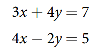
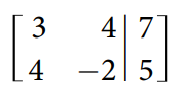
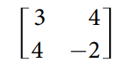
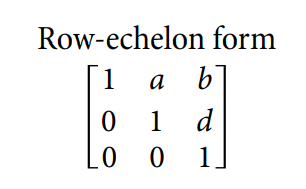
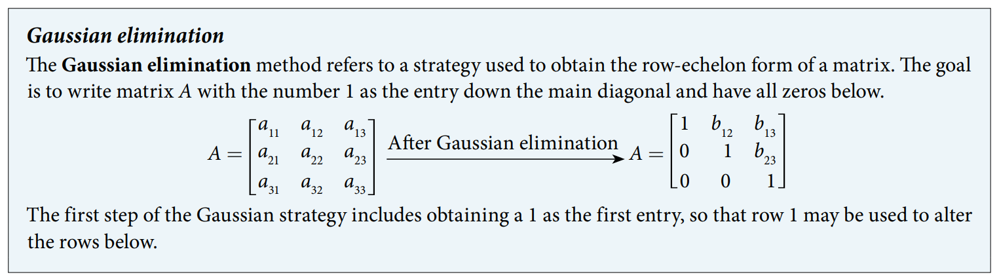

### 11.6 Solving Systems with Gaussian Elimination

- The augmented matrix and the coefficient matrix








- 🎯 `jupyter-lab` practice

``` 
# Example 1

from sympy import symbols
from sympy.matrices import Matrix

M = Matrix([
    [1, 2, -1, 3],
    [2, -1, 2, 6],
    [1, -3, 3, 4] ])

M
```


- The row-echolon form (ref)






- 🎯 `jupyter-lab` practice

``` 
# Example 3

from sympy import symbols, Rational
from sympy.matrices import Matrix

M = Matrix([
    [2, 3, 6],
    [1, -1, Rational(1,2)] ])

M

M_rref, M_pivot =  M.rref()  # reduced row-echelon form (rref)


M_rref

M_pivot
```


- 🎯 `jupyter-lab` practice

``` 
# Example 4

from sympy import symbols, Rational
from sympy.matrices import Matrix

M = Matrix([
    [2, 1, 1],
    [4, 2, 6] ])

M

M_rref, M_pivot =  M.rref()  # reduced row-echelon form (rref)


M_rref

M_pivot
```


- 🎯 `jupyter-lab` practice

``` 
# Example 5

from sympy import symbols, Rational
from sympy.matrices import Matrix

M = Matrix([
    [3, 4, 12],
    [6, 8, 24] ])

M

M_rref, M_pivot =  M.rref()  # reduced row-echelon form (rref)


M_rref

M_pivot
```


- 🎯 `jupyter-lab` practice

``` 
# Example 6

from sympy import symbols, Rational
from sympy.matrices import Matrix

M = Matrix([
    [1, -3, 4, 3],
    [2, -5, 6, 6],
    [-3, 3, 4, 6] ])

M

M_rref, M_pivot =  M.rref()  # reduced row-echelon form (rref)


M_rref

M_pivot
```


- 🎯 `jupyter-lab` practice

``` 
# Example 7

from sympy import symbols, Rational
from sympy.matrices import Matrix

M = Matrix([
    [1, -1, 1, 8],
    [2, 3, -1, -2],
    [3, -2, -9, 9] ])

M

M_rref, M_pivot =  M.rref()  # reduced row-echelon form (rref)


M_rref

M_pivot
```


- 🎯 `jupyter-lab` practice

``` 
# Example 8

from sympy import symbols, Rational
from sympy.matrices import Matrix

M = Matrix([
    [-1, -2, 1, -1],
    [2, 3, 0, 2],
    [0, 1, -2, 0] ])

M

M_rref, M_pivot =  M.rref()  # reduced row-echelon form (rref)


M_rref

M_pivot
```


- 🎯 `jupyter-lab` practice

``` 
# Example 9

from sympy import symbols, Rational
from sympy.matrices import Matrix

M = Matrix([
    [5, 3, 9, -1],
    [-2, 3, -1, -2],
    [-1, -4, 5, 1] ])

M

M_rref, M_pivot =  M.rref()  # reduced row-echelon form (rref)


M_rref

M_pivot
```


