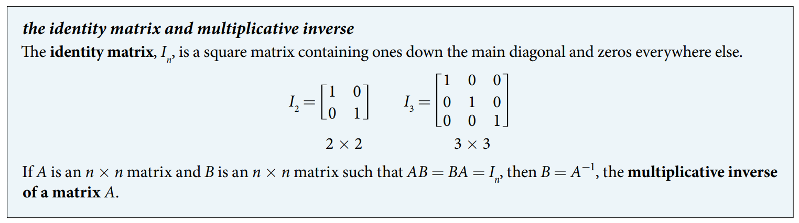
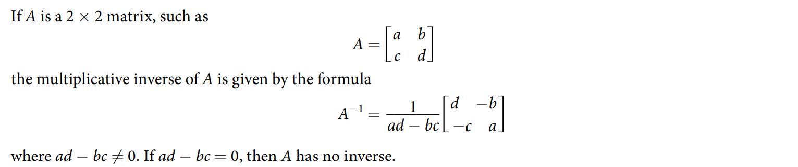
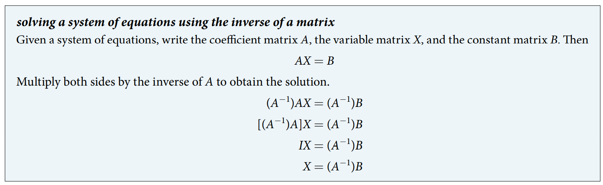

### 11.7 Solving Systems with Inverses

- The identity matrix $I$
$$
I = \begin{bmatrix}
1 & 0 & \dots & 0 \\
0 & 1 & \dots & 0 \\
\vdots & \vdots & \ddots & \vdots \\
0 & 0 & \dots & 1
\end{bmatrix}
$$
such that
$$ AI = IA = A $$
for the $n \times n$ matrix $A$.

- The matrix multipilicative properties:
$$ A A^{-1} I \\ A^{-1} A = I  $$





- 🎯 `jupyter-lab` practice

``` 
# Example 1

from sympy.matrices import Matrix

A = Matrix( [ 
    [3, 4],
    [-2, 5]
] )

A

I = Matrix( [ 
    [1, 0],
    [0, 1]
] )

I

A*I

I*A
```


- 🎯 `jupyter-lab` practice

``` 
# Example 2

from sympy.matrices import Matrix

A = Matrix( [ 
    [1, 5],
    [-2, -9]
] )

A

B = Matrix( [ 
    [-9, -5],
    [2, 1]
] )

B

A*B

B*A
```


- 🎯 `jupyter-lab` practice

``` 
# Example 3

from sympy.matrices import Matrix


A = Matrix( [ 
    [1, -2],
    [2, -3]
] )

A

A.inv()
```





- 🎯 `jupyter-lab` practice

``` 
# Example 5

from sympy.matrices import Matrix


A = Matrix( [ 
    [3, 6],
    [1, 2]
] )

A

A.inv()
```


- 🎯 `jupyter-lab` practice

``` 
# Example 6

from sympy.matrices import Matrix

A = Matrix( [ 
    [2, 3, 1],
    [3, 3, 1],
    [2, 4, 1]
] )

A

A_inv = A.inv()
A_inv

A*A_inv

A_inv*A
```





- 🎯 `jupyter-lab` practice

``` 
# Example 7

from sympy.matrices import Matrix

A = Matrix( [ 
    [3, 8],
    [4, 11]
] )

A

B = Matrix( [
    [5],
    [7]
] )

B

A_inv = A.inv()
A_inv

A_inv*B
```


- 🎯 `jupyter-lab` practice

``` 
# Example 8

from sympy.matrices import Matrix

A = Matrix( [ 
    [5, 15, 56],
    [-4, -11, -41],
    [-1, -3, -11]
] )

A

B = Matrix( [
    [35],
    [-26],
    [-7]
] )

B

A_inv = A.inv()
A_inv

A_inv*B
```