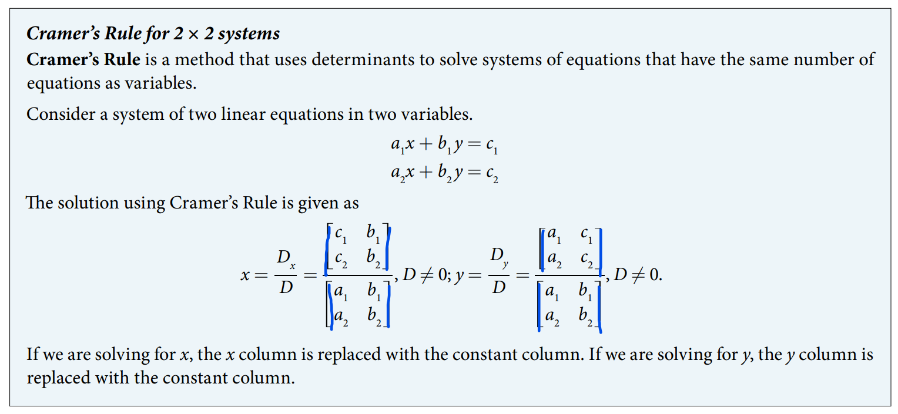
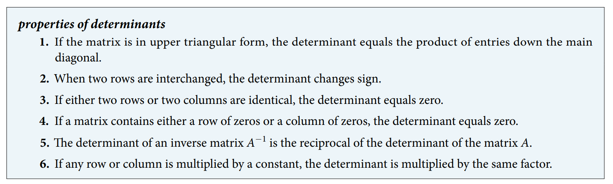

### 11.8 Solving Systems with Cramer's Rule


- 🎯 `jupyter-lab` practice

``` 
# Example 1

from sympy.matrices import Matrix

A = Matrix( [
    [5, 2],
    [-6, 3]
] )

A

A.det()
```





- 🎯 `jupyter-lab` practice

``` 
# Example 2

from sympy.matrices import Matrix

A = Matrix( [
    [12, 3],
    [2, -3]
] )

A

B = Matrix( [
    [15],
    [13]
] )

B

D = A.det()
D

X = A[:, :]  # X = A is a shallow copy, but we need a deep copy here.
X[:, 0] = B
X

Dx = X.det()
Dx

Dy = Y.det()
Dy

x = Dx/D
x

y = Dy/D
y

A.inv()*B  # solve by the inverse matrix
```


- 🎯 `jupyter-lab` practice

``` 
# Example 3

from sympy.matrices import Matrix

A = Matrix( [
    [0, 2, 1],
    [3, -1, 1],
    [4, 0, 1]
] )

A

A.det()
```


- 🎯 `jupyter-lab` practice

``` 
# Example 4

from sympy.matrices import Matrix

A = Matrix( [
    [1, 1, -1],
    [3, -2, 1],
    [1, 3, -2]
] )

A

B = Matrix( [
    [6],
    [-5],
    [14]
] )

B

X = A[:, :]
Y = A[:, :]
Z = A[:, :]

X[:, 0] = B
Y[:, 1] = B
Z[:, 2] = B

D = A.det()
Dx = X.det()
Dy = Y.det()
Dz = Z.det()

D  # check D != 0

x = Dx/D
y = Dy/D
z = Dz/D

x

y

z
```


- 🎯 `jupyter-lab` practice

``` 
# Example 5

from sympy.matrices import Matrix

A = Matrix( [
    [3, -2],
    [6, -4]
] )

A

B = Matrix( [
    [4],
    [0]
] )

B

D = A.det()
D  # check D != 0
```


- 🎯 `jupyter-lab` practice

``` 
# Example 6

from sympy.matrices import Matrix

A = Matrix( [
    [1, -2, 3],
    [3, 1, -2],
    [2, -4, 6]
] )

A

B = Matrix( [
    [0],
    [0],
    [0]
] )

B

D = A.det()
D  # check D != 0
```





- 🎯 `jupyter-lab` practice

``` 
# Example 7 ( property 1)

from sympy.matrices import Matrix

A = Matrix( [
    [1, 2, 3],
    [0, 2, 1],
    [0, 0, -1]
] )

A

A.det()

A[0, 0] * A[1, 1] * A[2, 2] 
```


- 🎯 `jupyter-lab` practice

``` 
# Example 7 ( property 2)

from sympy.matrices import Matrix

A = Matrix( [
    [-1, 5],
    [4, -3]
] )

A

B = Matrix( [
    [4, -3],
    [-1, 5]
] )

B

A.det()

B.det()
```


- 🎯 `jupyter-lab` practice

``` 
# Example 7 ( property 3: two columns are identical)

from sympy.matrices import Matrix

A = Matrix( [
    [1, 2, 2],
    [2, 2, 2],
    [-1, 2, 2]
] )

A

A.det()  # No solution
```


- 🎯 `jupyter-lab` practice

``` 
# Example 7 ( property 3: two rows are identical)

from sympy.matrices import Matrix

A = Matrix( [
    [1, 2, 3],
    [2, 2, 2],
    [2, 2, 2]
] )

A

A.det()  # Infinitely many solution
```


- 🎯 `jupyter-lab` practice

``` 
# Example 7 ( property 4: one zero row)

from sympy.matrices import Matrix

A = Matrix( [
    [1, 2],
    [0, 0]
] )

A

A.det()
```


- 🎯 `jupyter-lab` practice

``` 
# Example 7 ( property 4: one zero column)

from sympy.matrices import Matrix

A = Matrix( [
    [1, 0],
    [2, 0]
] )

A

A.det()
```


- 🎯 `jupyter-lab` practice

``` 
# Example 7 ( property 5)

from sympy.matrices import Matrix

A = Matrix( [
    [1, 2],
    [3, 4]
] )

A

A.det()

A.inv().det()
```


- 🎯 `jupyter-lab` practice

``` 
# Example 7 ( property 6: row multiplication)

from sympy.matrices import Matrix

A = Matrix( [
    [1, 2],
    [3, 4]
] )

A

B = Matrix( [
    [2*1, 2*2],
    [3, 4]
] )

B

A.det()

B.det()
```


- 🎯 `jupyter-lab` practice

``` 
# Example 7 ( property 6: colum multiplication)

from sympy.matrices import Matrix

A = Matrix( [
    [1, 2],
    [3, 4]
] )

A

B = Matrix( [
    [2*1, 2],
    [2*3, 4]
] )

B

A.det()

B.det()
```


