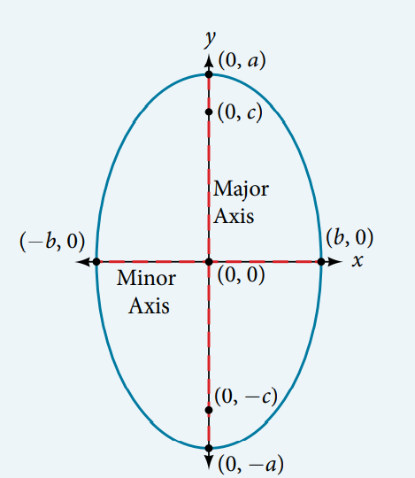

### 12.1 The Ellipse


- A circle is the special case of an ellipse. (See [Intermediate Algebra 2e - 11.1 Distance and Midpoint Formulas; Circles](https://openstax.org/books/intermediate-algebra-2e/pages/11-1-distance-and-midpoint-formulas-circles) )


- A circle has the equal major and minor axes.





- The standard forms of the equation of a circle with center $(0, 0)$:
    - an ellipse becomes a circle with its radius $r$ when $a = r$ and $c = 0$ (the ellipse's foci collapse to its center)
$$
    \dfrac{x^2}{r^2} + \dfrac{y^2}{r^2} = 1
$$
or more frequently
$$
    x^2 + y^2 = r^2.
$$


- 🎯 `jupyter-lab` practice

``` 
# Example 1

```