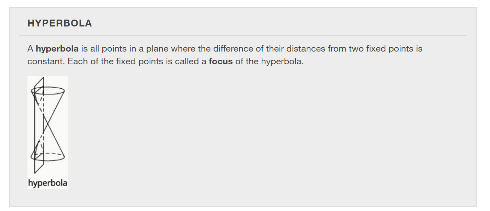
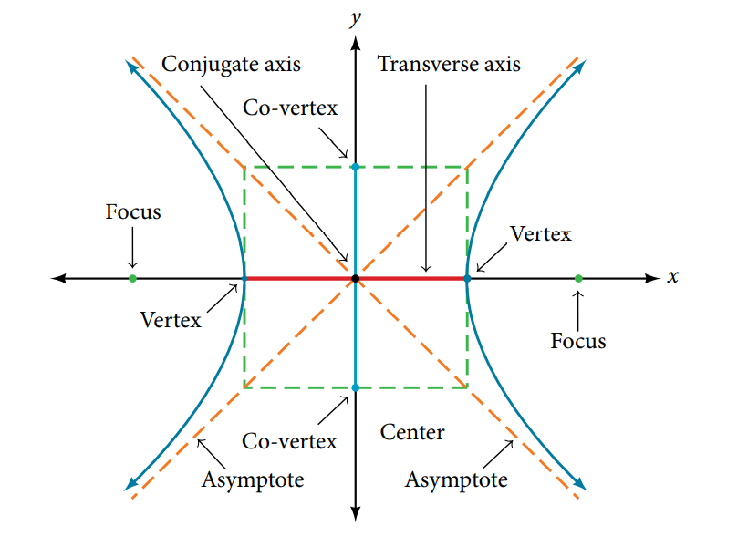
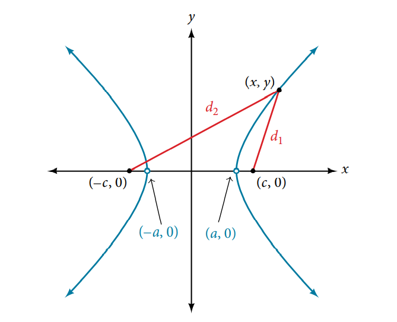
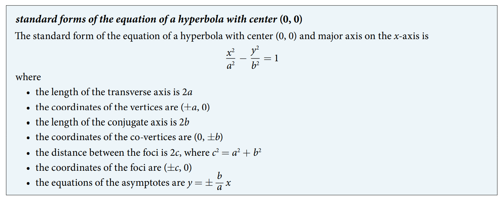
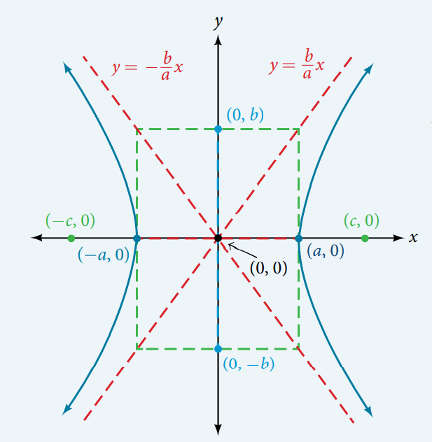
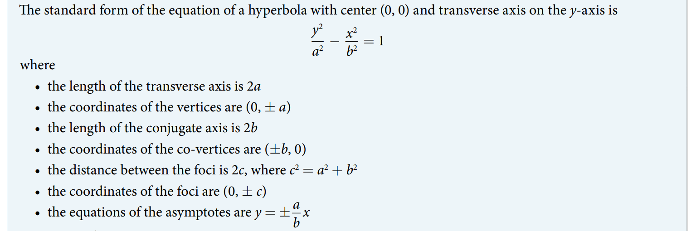
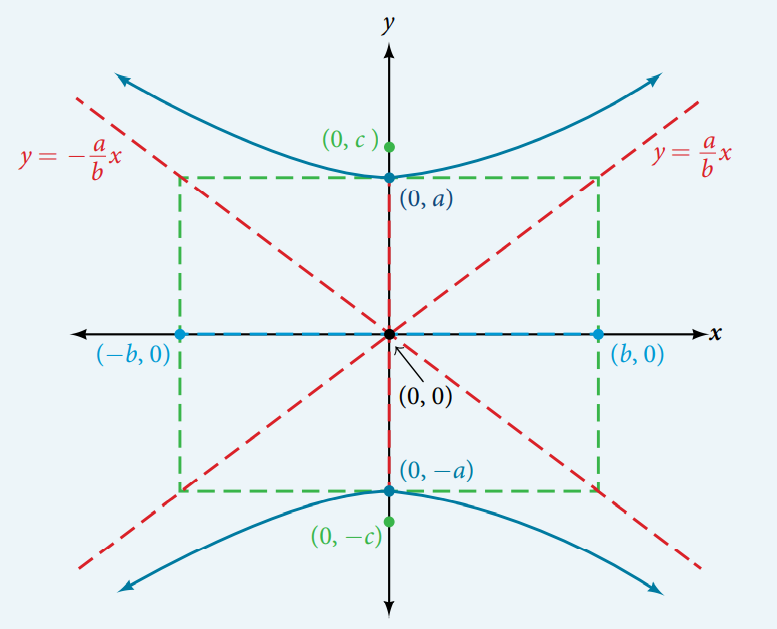
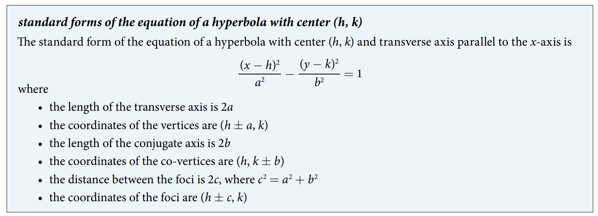
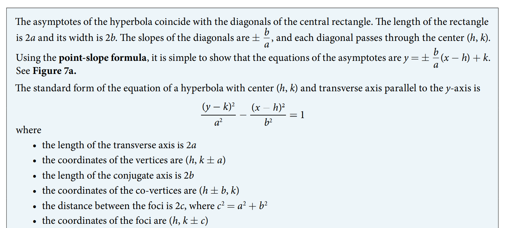
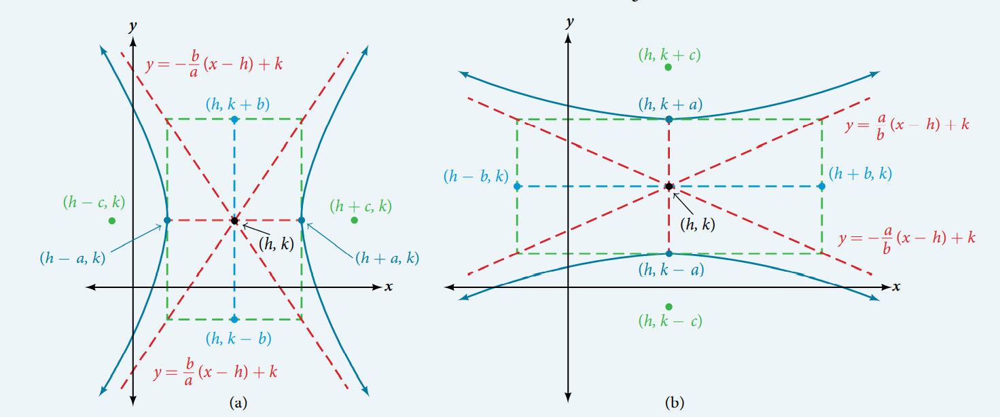

### 12.2 The Hyperbola
























- 🎯 `jupyter-lab` practice

``` 
# Example 4

%matplotlib widget
import matplotlib.pyplot as plt
import numpy as np

x = np.arange(-10, 10, 0.0001)
y1 = np.sqrt(64*(x**2/36 + 1))
y2 = -np.sqrt(64*(x**2/36 + 1))
y3 = 8/6*x
y4 = -8/6*x
fig, ax = plt.subplots()
ax.plot(x, y1, 'C0')
ax.plot(x, y2, 'C0')
ax.plot(x, y3, 'r--')
ax.plot(x, y4, 'r--')
ax.scatter(0, -8, color='r')
ax.scatter(0, 8, color='r')
ax.scatter(-6, 0, color='g')
ax.scatter(6, 0, color='g')
ax.scatter(0, -10, color='b')
ax.scatter(0, 10, color='b')

ax.set_aspect('equal', 'box')

plt.grid(which='major', color='#666666', linestyle='-')
plt.minorticks_on()
plt.grid(which='minor', color='#999999', linestyle='-', alpha=0.2)

plt.xlim(-10, 10)
plt.ylim(-17, 17)
```


