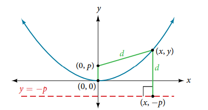

### 12.3 The Parabola





- 🎯 `jupyter-lab` practice

``` 
# Example 1

%matplotlib widget
import matplotlib.pyplot as plt
import numpy as np

x = np.arange(0, 20, 0.001)
y1 = np.sqrt(24*x)
y2 = -np.sqrt(24*x)
           
fig, ax = plt.subplots()
ax.plot(x, y1, 'C0')
ax.plot(x, y2, 'C0')
ax.axvline(x = -6, color='r', linestyle='--')

ax.scatter(0, 0, color='k')
ax.scatter(6, 0, color='r')
ax.scatter(6, 12, color='b')
ax.scatter(6, -12, color='b')
ax.axline((6, -12), (6, 12), color='g', linestyle='--')
ax.set_aspect('equal', 'box')

plt.grid(which='major', color='#666666', linestyle='-')
plt.minorticks_on()
plt.grid(which='minor', color='#999999', linestyle='-', alpha=0.2)

plt.xlim(-20, 20)
plt.ylim(-20, 20)
```


